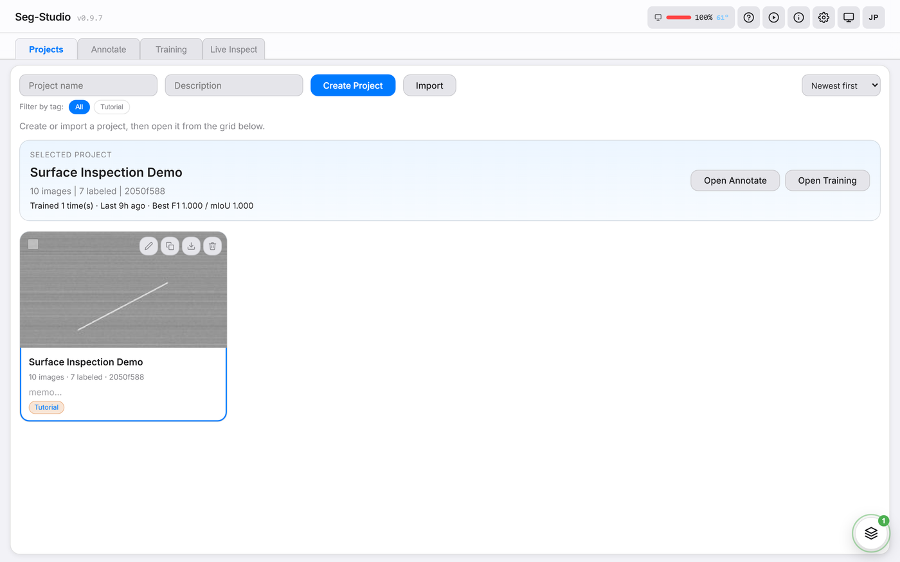
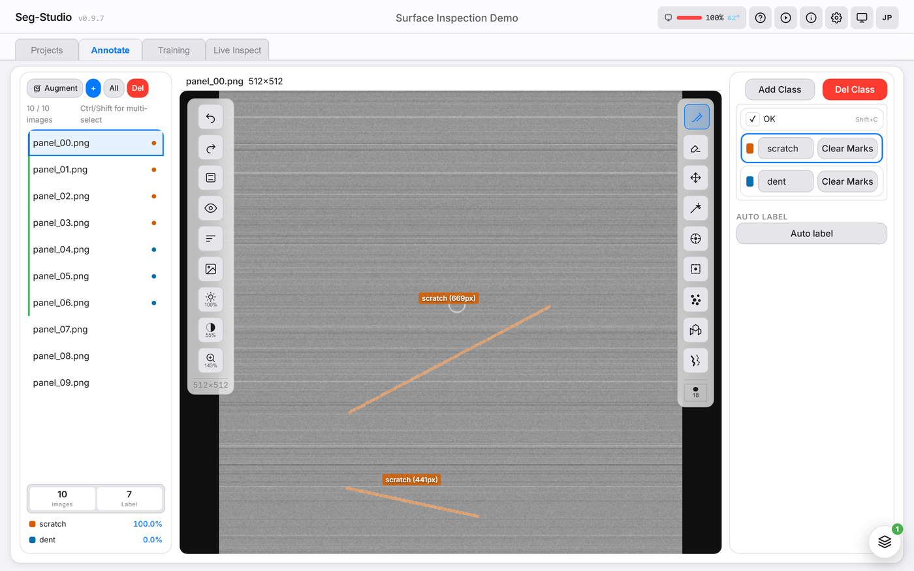
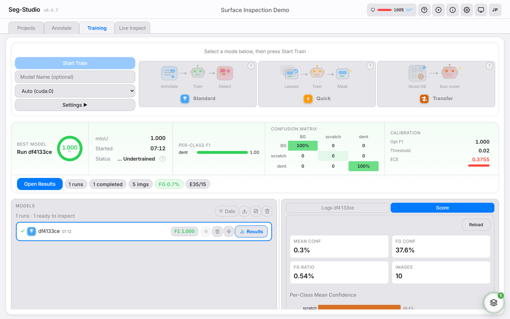
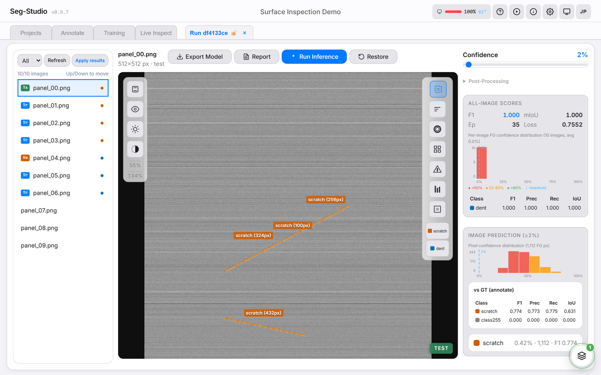

<div align="center">

# Seg-Studio

**画像セグメンテーションモデルの学習、アノテーション、デプロイを一つのデスクトップアプリで。**


Seg-Studio は、ローカルマシン上で完結するオープンソースの画像セグメンテーション統合環境です。SAM を活用したスマートツールで画像をアノテーションし、PyTorch モデルをリアルタイム監視付きで学習し、CoreML や ONNX にエクスポートしてエッジデバイスにデプロイできます。クラウドアカウントは不要です。セマンティックセグメンテーションに加えて、既に描いたマスクをそのまま流用して物体を 1 個ずつ数えることもできます (追加のアノテーションは不要です)。

[クイックスタート](#クイックスタート) | [機能一覧](#主な機能) | [English](README.md)

</div>

<p align="center">
  
</p>

<p align="center"><sub>44 秒の一連の流れ: SAM クリックでアノテーション → auto-tune で学習 → ヒートマップと評価レポートを確認 → ONNX / CoreML へエクスポート。</sub></p>

---

## どこから読むか

試すまでは 3 ステップです。**ZIP をダウンロード → `install` と `start` を実行 →
`http://localhost:8002/ui/` を開く。** 実際のコマンドは下の
[クイックスタート](#クイックスタート) にあります。

| 目的 | 読むもの |
|---|---|
| **はじめて使う** | まず [クイックスタート](#クイックスタート) でインストールし、続けて [はじめてのファーストラン手順](docs/ja/first-run-manual.md) へ。アプリを開いてから最初の推論結果までを一本道でたどる最短手順です（約 10 分） |
| **インストールや起動でつまずいた** | [トラブルシューティング](docs/ja/troubleshooting.md) |
| **特定の機能を調べたい** | [ユーザーガイド](docs/ja/user-guide.md) — 各タブ・ツール・設定のリファレンス |
| **一通り詳しく学びたい** | [はじめてのハンドブック](docs/ja/handbook.md) — サンプルデータで同じ流れを最初から最後まで通す全 16 章のチュートリアル |
| **共有マシンや LAN で動かしたい** | [デプロイ手順](docs/ja/deployment.md) — トークンでのサインイン、リバースプロキシ、バックアップ |
| **開発に参加したい** | [CONTRIBUTING.md](CONTRIBUTING.md)（英語）と [開発者クイックスタート](docs/ja/dev-quickstart.md) |

---

## スクリーンショット

<table>
  <tr>
    <td align="center">
      <br />
      <b>Projects</b> -- データセットと学習結果の管理
    </td>
    <td align="center">
      <br />
      <b>Annotate</b> -- ブラシ、ワンド、SAM クリックなど
    </td>
  </tr>
  <tr>
    <td align="center">
      <br />
      <b>Training</b> -- リアルタイムの損失値と F1 曲線
    </td>
    <td align="center">
      <br />
      <b>Results</b> -- 推論結果、ヒートマップ、エクスポート
    </td>
  </tr>
</table>

---

## なぜ Seg-Studio なのか

| | **Seg-Studio** | LabelMe | CVAT | Label Studio |
|---|:---:|:---:|:---:|:---:|
| アノテーションツール | あり | あり | あり | あり |
| SAM クリックセグメンテーション | 5モデル内蔵 | なし | 組み込み | ML Backend 経由 |
| モデル学習（内蔵） | あり | なし | なし | ML Backend 経由 |
| リアルタイム学習モニター | あり | N/A | N/A | N/A |
| CoreML / ONNX エクスポート | あり | N/A | N/A | N/A |
| 単一 GPU、クラウド不要 | あり | あり | Docker | Docker or Cloud |
| 自動チューニング（損失、LR、重み） | あり | N/A | N/A | N/A |

---

## 主な機能

要点だけ挙げると、ブラシ / ワンド / SAM クリックで画像にラベルを付け、PyTorch の
セグメンテーションモデルを手元の PC で学習し（損失と F1 はリアルタイムに確認できます）、
推論結果を確認して ONNX または CoreML に書き出す、という流れです。既に描いたマスクを
流用した個数カウントにも対応しています。

DINOv2 特徴蒸留、Lovász-Softmax、後処理 CCA、OpenVINO INT8、Perlin CutPaste 合成、
MLP Assist、グローバル学習キューといった応用機能は、いずれも任意です。インストール
手順をページ上部に残すため、以下の折りたたみに全件をそのまま収めています。1 枚もので
俯瞰したい場合は [機能カタログ](docs/ja/catalog.md) をご覧ください。

<details>
<summary><b>機能一覧（全件）</b> — クリックで展開</summary>

**アノテーション**
- ブラシ、消しゴム、ワンド（フラッドフィル）、スポット検出、クラックトレース、スーパーピクセル
- Move ツール：マスク領域のドラッグによる位置調整
- Mark Clean：欠陥なし画像のフラグ付け
- SAM クリックセグメンテーション -- 5 モデル対応（MobileSAM、SAM2 Tiny/Small、TinySAM、EfficientSAM）
- MLP Assist による半自動ラベリング
- レシピベースの自動ラベリングパイプライン

**学習**
- PyTorch 学習 + WebSocket によるリアルタイム監視（損失値、F1、mIoU）
- 学習モード選択：通常 / クイック / 転移学習 / 個数カウント
- 個数カウント (インスタンスセグメンテーション)：接触した物体を 1 個ずつ分離。既存マスクからの合成データで学習するため追加アノテーション不要
- カウントのタイル学習・推論：小さな物体を撮影時の解像度のまま扱う (学習と推論は常に同一パッチサイズ)
- Auto-config v2：プロジェクト統計から arch / patch_size / base_channels を自動推薦
- 重心ベースのアノテーションパッチサンプリング
- Lovász-Softmax Loss
- 損失関数、学習率、クラス重みの自動チューニング
- 高解像度画像向けスライディングウィンドウ検証
- 知識蒸留サポート（DINOv2 特徴量蒸留）
- マルチプロジェクト対応のグローバル学習キュー（予約 run の自動起動）

**Results とデプロイ**
- GT / 推論マスクの分離表示、パターンオーバーレイ（斜線 / ドット / 格子）
- ピクセルレベルの Confidence ヒートマップ、ヒストグラム、画像ごとのスコア
- 後処理 CCA（連結成分、最小面積フィルタ）
- Live inspection モード、複数プロジェクトのバッチエクスポート
- 評価レポート生成（HTML / PDF / Excel）
- iPad / iPhone デプロイ向け CoreML エクスポート
- クロスプラットフォーム推論向け ONNX エクスポート
- OpenVINO IR エクスポート（INT8 量子化対応、`--with-openvino` でのオプトインインストール）
- Results ビューでのカウント・面積計測 (連結成分)。カウントモデル学習時は個体単位のカウントも可能
- `POST /count` サービングエンドポイント：クラス別個数と個体ごとの矩形を返す

**インターフェース**
- 日英バイリンガル UI（ヘッダーからいつでも切り替え可能）

**インタラクティブなオンボーディング**
- UI 内ハンズオンチュートリアル：初級 / 中級 / エキスパートの 3 モード、
  スポットライトオーバーレイ、SVG アニメ、キーボードショートカットに対応。
  ヘッダーの ▶ ボタンからいつでも再生可能。
- 「次に見るべきタブ」のガイド点滅と、未確認結果の青色パルスで
  初見ユーザーを各ステップへ誘導。

</details>

---

## クイックスタート

### 0. インストール前チェック

- **ディスク容量**: CUDA 版 PyTorch の導入について、インストーラー自身が
  **約 5 GB の空き** を目安として案内します（ダウンロードだけで約 2.5 GB）。
  OpenVINO を追加する場合はさらに約 300 MB、加えて 5 つの SAM チェックポイントも
  保存されます。画像・学習ラン・エクスポートしたモデルは同じフォルダ内の
  `projects/` に置かれるため、余裕のある場所に展開してください。
- **管理者権限は通常不要です**: 書き込み先は展開したフォルダの中だけです
  （仮想環境 `.venv-windows` / `.venv-macos`、`models/`、`logs/`、`projects/`）。
  管理者権限が要るのは、Windows インストーラーに `winget` 経由で
  Python・Node.js・git を入れさせる場合と、`npm install` が権限エラーで
  失敗した場合だけです。
- **Windows ではパスを短くしてください**: パスが 260 文字を超えると仮想環境の
  作成に失敗します。インストーラーは `C:\seg-studio` のような短いパスへの移動を
  案内します。ウイルス対策ソフトが仮想環境の作成をブロックする場合は、その
  フォルダを除外設定に追加してください。
- **先に Python 3.10 以上を入れてください**: 見つからない場合、どちらの
  インストーラーも停止します。Windows インストーラーは 3.13 → 3.12 → 3.11 →
  3.10 の順に探し、依存関係のロックファイルは 3.11 向けにコンパイルされています。
  Windows では最後の手段として `winget install Python.Python.3.11` を試み、
  導入後に PATH が通っていない場合はターミナルを閉じて再実行するよう案内します。
  macOS では事前にご用意ください（`brew install python@3.11`）。
- **ブラウザ UI をビルドするのは Node.js 18 以上です**: ビルド済みの UI は
  リポジトリに含まれていない（`dist/` は未コミット）ため、`npm` が無いと API は
  起動しても `http://localhost:8002/ui/` に表示するものがありません。`npm` が無い
  場合、Windows インストーラーは `winget` で Node.js 22 LTS の導入を試み、macOS
  では警告して UI ビルドをスキップします。API だけで良い場合は `--skip-ui` を
  指定してください。
- **git: macOS では必須、Windows では自動導入。** `install-macos.sh` は git が
  無いと致命的な前提不足として停止します（`brew install git`）。
  `install-windows.bat` は Python や Node.js と同様に `winget` で git を導入し、
  それが失敗した場合のみ SAM アシスト用ライブラリをスキップして続行します。
  Windows は SAM チェックポイントの取得に `curl`（Windows 10 1803 以降に標準搭載）
  も使います。
- **ダブルクリックだけで完結します。** `install-windows.bat` と
  `start-windows.bat` は展開したフォルダの直下にあり、ダブルクリックした場合は
  結果を読めるようコンソールを開いたままにします。スクリプトから呼び出して
  すぐ戻したい場合は `SEG_NO_PAUSE=1` を設定してください（CI 環境でも同様）。
- **NVIDIA ドライバ**: 本リポジトリは最低ドライババージョンを固定していないため、
  ここでも具体的な数値は示しません。インストーラーが実際に見ているのは
  `nvidia-smi` を実行できるかどうかです。実行できれば CUDA 12.8 wheel（Turing /
  RTX 20xx 以降、Blackwell を含む）、できなければ CPU 版が入ります。Maxwell /
  Pascal / Volta では `install-windows.bat cuda124` をお使いください。導入後は
  `python -c "import torch; print(torch.cuda.is_available())"` が `True` を返すことを
  ご確認ください。
- **SAM の重みが無くても、SAM クリックアシスト以外はすべて動作します**:
  ブラシ、消しゴム、ワンド、スポット検出、クラック追跡、スーパーピクセル、
  MLP アシスト、学習、評価、各種エクスポートはいずれも SAM の重みに依存しません。
  5 つのチェックポイントは Windows インストール時に、それ以外では初回使用時に
  ダウンロードされ、ソースに記録された SHA-256 で検証されます。
- **インターネットはインストール時に必要で、動作時には不要です**: インストール時に
  PyPI から PyTorch と Python 依存関係、GitHub から SAM アシスト用ライブラリ、
  SAM チェックポイント、UI の npm パッケージを取得します。それ以降、
  アノテーション・学習・評価・エクスポートはすべてローカルで動作します。例外は
  2 つで、未取得の SAM チェックポイントと、DINOv2 蒸留のモデル定義（有効化した
  初回に `torch.hub` 経由で取得）です。オフライン環境向けには、接続済みマシンで
  `python scripts/install.py --offline-pack <dir>` を実行してバンドルを作成して
  ください。

### 1. コードを入手する（git 不要）

[Releases ページ](https://github.com/segmen-pixel/seg-studio/releases) から
**Windows は事前準備なしで動かせます**:
[Releases ページ](https://github.com/segmen-pixel/seg-studio/releases) から
**Seg-Studio-v0.9.8-win64.zip** をダウンロードし、好きな場所に展開して
`Seg-Studio.bat` をダブルクリックしてください。Python と CUDA 版 PyTorch を
同梱しているため、Python も git も CUDA Toolkit も事前インストールは不要で、
下の「2.」は読み飛ばして構いません。同梱している分、ダウンロードは
約 3 GB と大きめです。

**それ以外のプラットフォーム、および自分でビルドしたい Windows の場合**:
最新の **Source code (zip)** をダウンロードし、好きな場所に展開してください
（リポジトリページ上部の緑の **Code → Download ZIP** ボタンでも同じです）。
git を使う場合: `git clone https://github.com/segmen-pixel/seg-studio.git`

各リリースには `SHA256SUMS.txt` を添付しています。実行する前に照合できます。

```powershell
# Windows PowerShell
(Get-FileHash Seg-Studio-v0.9.8-win64.zip -Algorithm SHA256).Hash
```

```bash
# macOS / Linux
shasum -a 256 -c SHA256SUMS.txt --ignore-missing
```

### 2. インストールして起動する

**Windows（NVIDIA GPU）:**
```bash
install-windows.bat
start-windows.bat
```

ターミナルは不要です。展開したフォルダ直下の `install-windows.bat` →
`start-windows.bat` をダブルクリックするだけでも動きます。インストーラーは GPU を自動判別し
（`cpu` / `cuda124` 指定で上書き可）、Python 3.10+ が見つからない場合は
インストール手順を案内します。起動スクリプトはサーバー準備完了後に
ブラウザで UI を自動的に開きます。

**macOS（Apple Silicon / Intel）:**
```bash
bash install-macos.sh
bash start-macos.sh
```

停止は `stop-windows.bat` / `bash stop-macos.sh` でできます。

> Windows のインストーラーは必要なものを自分で用意します。Python・Node.js・git が
> 無ければ winget 経由で自動インストールするので、3 つとも入っていない PC でも
> ダブルクリック 1 回で動く状態になります。winget が無い環境（Windows 10 で
> App Installer が入っていない場合など）では Python の入手先を案内して停止します。
> Node.js と git は無くても停止はせず、Node.js が無ければ UI が再ビルドされず、
> git が無ければ SAM クリックセグメンテーションが使えません。
> macOS では git が必須で、`install-macos.sh` は git が無いと
> 停止します。
> macOS の Apple Silicon では MPS（Metal）が自動的に使われます。推論だけでなく
> 学習にも使えますが、個数カウントには NVIDIA GPU が必要です。
> どの環境で何が動くかは [プラットフォーム対応](#プラットフォーム対応) を
> 参照してください。

### 3. UI を開く

ブラウザで **http://localhost:8002/ui/** を開いてください。インストールはこれで完了です。

セグメンテーションが初めての方は、続けて
[はじめてのファーストラン手順](docs/ja/first-run-manual.md) へお進みください。
アプリを開いてから最初の推論結果まで、約 10 分でたどれます。

### 別の方法: Docker（docker compose）

Linux 向けの導線です。CPU のみで、学習はできません。

```bash
# Windows の場合は python3 ではなく python を使ってください
python3 -c "import secrets; print('SEG_API_TOKEN=' + secrets.token_urlsafe(24))" >> .env
docker compose up --build
```

ブラウザで **http://localhost:5173/** を開いてください。UI コンテナの nginx が
`/api`、`/v2`、`/ws` を trainer API にプロキシします。すべてのポートは
`127.0.0.1` のみに公開されます。`.env` の作成は任意ではなく必須です。各コンテナは
自身のネットワーク名前空間の中で `0.0.0.0` にバインドするため、トークンなしでは
trainer が起動を拒否します。また GPU を要求していないので、アノテーション・推論・UI は
動きますが学習はできません。詳細は [デプロイメント](docs/ja/deployment.md) を参照してください。

---

## ワークフロー

```
Projects  -->  Annotate  -->  Train  -->  Results  -->  Deploy
   |              |             |            |            |
 プロジェクト   SAM、ブラシ、   パラメータ    推論結果の    CoreML
 の作成または   ワンド、MLP     設定と学習    評価と比較    または ONNX
 インポート     でラベル付け    の実行                     にエクスポート
```

---

## アーキテクチャ選択

| アーキテクチャ | パラメータ数 | モデルサイズ | 推論 (RTX 3090) | 特徴 |
|---|---:|---:|---:|---|
| **SimpleUNet** (bc=64) | 1.9 M | 7.3 MB | 2.9 ms · 339 img/s | 安定、高 F1、GroupNorm + SE attention |
| **STDC** (bc=32) | 2.9 M | 11.2 MB | 1.3 ms · 758 img/s | 軽量、最速推論 |

全モデルが GroupNorm、JIT トレーシング、設定可能な output stride に対応しています。
推論レイテンシは 256×256・バッチサイズ1 の単一画像での値です。GPU + CPU の
完全なベンチマークと再現方法は [BENCHMARKS.md](BENCHMARKS.md) を参照してください。

学習のデフォルトは **SimpleUNet** です — 小さく安定していて、最初の
一本に向いています。アーキテクチャはデータセットのプロファイルから
auto-config が提案するため、手で選ぶ必要はほとんどありません。37
プロジェクトの工場検査ライブラリでは STDC が SimpleUNet より多くの
プロジェクトで per-project best (15 対 5) だったので、精度や推論速度を
優先する場合は STDC を試してください。

---

## MCP ブリッジ

Seg-Studio を MCP 対応ツールに接続して、プログラムからプロジェクトを検査できます:

```bash
pip install fastmcp httpx
python scripts/mcp_server.py --api http://localhost:8002 --policy read
```

データセット、アノテーション、学習、推論、エクスポート、システムの各カテゴリにわたる 37 ツールを提供。ポリシーレベル: `read`、`write`、`full`。

---

## 動作環境

- **OS:** Windows 10 / 11（64-bit）、macOS 12 以上（Apple Silicon 推奨）、または
  `docker compose` 経由の Linux（`.bat` / `.sh` インストーラーが対象とするのは
  Windows と macOS のみです）
- **Python:** 3.10 以上（依存関係のロックファイルは 3.11 向けにコンパイル）
- **Node.js:** 18 以上（UI ビルド用）
- **ディスク:** CUDA 版の導入に約 5 GB の空き。詳細はクイックスタートの
  「0. インストール前チェック」を参照してください

### プラットフォーム対応

| | Windows + NVIDIA | Apple Silicon（MPS） | CPU のみ |
|---|---|---|---|
| アノテーション / SAM アシスト | 対応 | 対応（SAM 5 種のうち 4 種。TinySAM は macOS では導入されません） | 対応 |
| セマンティックセグメンテーションの学習 | 対応 | 対応 | 対応（大幅に低速） |
| 個数カウント（インスタンス）の学習 | 対応 | 非対応 | 非対応 |
| ONNX エクスポート | 対応 | 対応 | 対応 |
| ONNX 推論 | 対応（CUDA プロバイダ） | 対応（CPU プロバイダ） | 対応（CPU プロバイダ） |
| Core ML エクスポート | `coremltools` を import できる場合のみ | 対応 | `coremltools` を import できる場合のみ |

- 学習のデバイス選択は既定が `auto` で、CUDA → MPS → CPU の順に選ばれます。
  NVIDIA でのセマンティックセグメンテーション学習は VRAM 4 GB 以上を推奨します。
- Windows インストーラーの既定は CUDA 12.8 PyTorch wheel（Turing / RTX 20xx
  以降、Blackwell RTX 5090 を含む）です。旧世代 GPU（Maxwell / Pascal / Volta）
  では `install-windows.bat cuda124` で CUDA 12.4 wheel を導入します。
- MPS では混合精度が無効になるため、同等の NVIDIA GPU より学習は遅くなります。
  MPS はシステム全体と共有するユニファイドメモリを使うため、メモリ不足になる
  場合は [トラブルシューティング](docs/ja/troubleshooting.md) を参照してください。
- **個数カウント（インスタンスセグメンテーション）の学習には NVIDIA GPU が
  必要です。** VRAM の自動調整は CUDA デバイスでのみ行われ、RTX 3090 での実測値
  では `small` モデルが既定のバッチ 8 で 8 GiB、バッチ 4 で 5.5 GiB、バッチ 2 で
  3.5 GiB を必要とします。3.5 GiB 未満は非対応です。
- Core ML エクスポートには `coremltools`（8.3.0 に固定）が必要で、import
  できない場合は HTTP 501 を返します。macOS インストーラーはこれを明示的に
  導入します。
- OpenVINO IR エクスポートは Windows インストーラーのオプション
  （`install-windows.bat --with-openvino`、約 300 MB）です。macOS
  インストーラーに同等のオプションはありません。
- macOS のビルド済みパッケージは意図的に提供していません。署名のない `.app` は
  利用者全員が Gatekeeper を手動で解除することになり、`install-macos.sh` を
  実行するより手間が増えるためです。Windows には同種の障害がないので、
  Windows のみビルド済みを配布しています。

---

## プロジェクト構成

```
seg-studio/
  apps/
    trainer_api/     # FastAPI バックエンド
    serving_api/     # ONNX 推論 API
    trainer_ui/      # React フロントエンド
  packages/
    segcore/         # 学習コア（モデル定義、データセット、学習ループ）
    seg-sdk/         # 推論 API 向け Python クライアント SDK
  models/
    sam_checkpoints/ # SAM モデルチェックポイント
  scripts/
    windows/         # Windows セットアップ・起動スクリプト
    macos/           # macOS セットアップ・起動スクリプト
```

---

## コミュニティ

- **コントリビュート** -- プルリクエストを歓迎します。大きな変更の場合は、まず Issue を作成してください。
- **ディスカッション** -- 質問やアイデアは [GitHub Discussions](https://github.com/segmen-pixel/seg-studio/discussions) をご利用ください。
- **セキュリティ** -- 脆弱性の報告は [GitHub Security Advisories](https://github.com/segmen-pixel/seg-studio/security/advisories) から非公開で送信してください。

---

## ドキュメント

### はじめての方へ

- 🚀 **[はじめてのファーストラン手順](docs/ja/first-run-manual.md)** — アプリを開いてから最初の推論結果までの最短手順（約 10 分）
- 📘 **[はじめてのハンドブック](docs/ja/handbook.md)** — サンプルデータで通す全 16 章のチュートリアル（画像→モデル→推論→SDK）
- 📗 **[機能カタログ](docs/ja/catalog.md)** — 機能一覧（1 枚もの、俯瞰用）

### リファレンス

- [ユーザーガイド](docs/ja/user-guide.md)
- [開発者クイックスタート](docs/ja/dev-quickstart.md)
- [デプロイ手順](docs/ja/deployment.md)
- [トラブルシューティング](docs/ja/troubleshooting.md)
- [インポート / エクスポート](docs/ja/import_export.md)
- [ロードマップ](docs/ja/ROADMAP.md)
- [API リファレンス](http://localhost:8002/docs)（サーバー起動中に利用可能）

英語版ドキュメントは [README.md](README.md) を参照してください。

---

<div align="center">

Copyright 2026 Segmen-Pixel and Seg-Studio contributors.
[Apache License 2.0](LICENSE) に基づきライセンスされます。

サードパーティライセンス: [THIRD_PARTY_NOTICES.md](THIRD_PARTY_NOTICES.md) /
上流アトリビューション: [NOTICE](NOTICE)

</div>

---

## 免責事項

本ソフトウェアおよび同梱・参照される学習済みモデル（SAM 系、DINOv2 等）は、
[Apache License 2.0](LICENSE) 第 7 条に基づき「現状有姿（AS IS）」で提供されます。
学習済みモデルの利用結果（推論結果の正確性、第三者の権利との関係を含む）について、
製作者および貢献者は一切の責任を負いません。
産業用途や安全性が要求される文脈で利用される場合は、利用者ご自身の責任で
適切な検証を行った上でご使用ください。

各社商標（Apple, CoreML, PyTorch, NVIDIA, CUDA, ONNX, SAM, DINOv2 等）は
それぞれの権利者に帰属します。詳細は [THIRD_PARTY_NOTICES.md](THIRD_PARTY_NOTICES.md)
をご参照ください。
