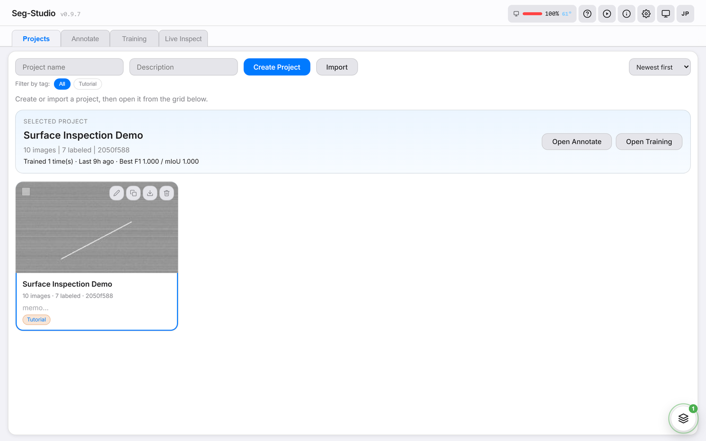
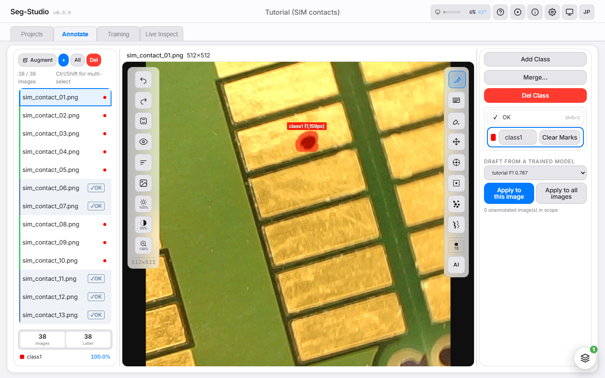
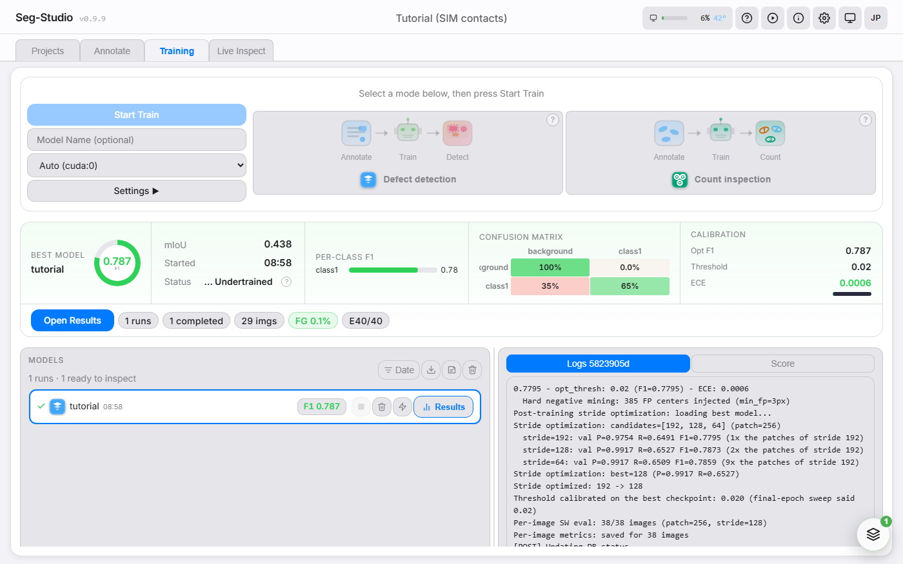
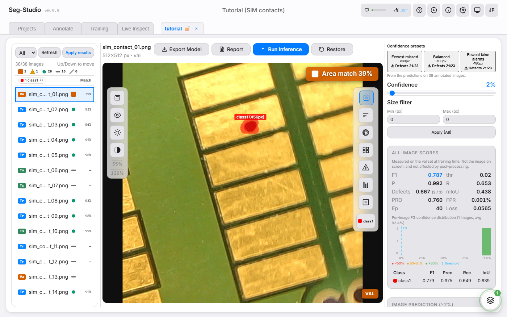

<div align="center">

# Seg-Studio

**Train, annotate, and deploy image segmentation models -- all in one desktop app.**


Seg-Studio is an open-source, all-in-one image segmentation workbench that runs entirely on your local machine. Annotate images with SAM-powered smart tools, train PyTorch models with real-time monitoring, and export to CoreML or ONNX for edge deployment -- no cloud account required. Alongside semantic segmentation it can count individual objects, reusing the masks you already drew rather than asking for new annotation.

[Quick Start](#quick-start) | [Features](#key-features) | [Japanese](README.ja.md)

</div>

<p align="center">
  
</p>

<p align="center"><sub>End-to-end in 44 s: annotate with SAM &rarr; train with auto-tuned recipe &rarr; inspect heatmap and report &rarr; export to ONNX / CoreML.</sub></p>

---

## Where to start

Three steps: **download the source &rarr; run `install` then `start` &rarr;
open `http://localhost:8002/ui/`.** The exact commands are in
[Quick Start](#quick-start) below.

| If you are... | Go here |
|---|---|
| **New here** | [Quick Start](#quick-start) to install, then the [First Run Walkthrough](docs/first-run-manual.md) — the shortest single path, from opening the app to your first prediction in about 10 minutes |
| **Stuck installing or starting the server** | [Troubleshooting](docs/troubleshooting.md) |
| **Looking up one feature** | [User Guide](docs/user-guide.md) — reference for every tab, tool and setting |
| **After the full detail** | [Beginner's Handbook](docs/handbook.md) — the same workflow carried end to end on a sample dataset, 16 chapters |
| **Running Seg-Studio on a shared machine or LAN** | [Deployment](docs/deployment.md) — token sign-in, reverse proxy, backups |
| **Contributing** | [CONTRIBUTING.md](CONTRIBUTING.md), plus the [Developer Quickstart](docs/dev-quickstart.md) |

---

## Screenshots

<table>
  <tr>
    <td align="center">
      <br />
      <b>Projects</b> -- Manage datasets and runs
    </td>
    <td align="center">
      <br />
      <b>Annotate</b> -- Brush, SAM click, and more
    </td>
  </tr>
  <tr>
    <td align="center">
      <br />
      <b>Training</b> -- Real-time loss and F1 curves
    </td>
    <td align="center">
      <br />
      <b>Results</b> -- Predictions, heatmaps, and export
    </td>
  </tr>
</table>

---

## Why Seg-Studio?

| | **Seg-Studio** | LabelMe | CVAT | Label Studio |
|---|:---:|:---:|:---:|:---:|
| Annotation tools | Yes | Yes | Yes | Yes |
| SAM click segmentation | 5 models built-in | No | Built-in | Via ML Backend |
| Model training (built-in) | Yes | No | No | Via ML Backend |
| Real-time training monitor | Yes | N/A | N/A | N/A |
| CoreML / ONNX export | Yes | N/A | N/A | N/A |
| Single GPU, no cloud needed | Yes | Yes | Docker | Docker or Cloud |
| Auto-tuning (loss, LR, weights) | Yes | N/A | N/A | N/A |

---

## Key Features

The short version: annotate with brush or SAM click; train a PyTorch
segmentation model on your own machine while loss and F1 update live; review
the predictions; export to ONNX or CoreML. It can also count objects, reusing
the masks you already drew.

Everything beyond that — DINOv2 distillation, Lovász-Softmax, CCA
post-processing, OpenVINO INT8, Perlin CutPaste, the global training
queue — is optional, and is folded away below so the install steps
stay near the top. The one-page tagged version is the
[Feature Catalog](docs/catalog.md).

<details>
<summary><b>Full feature list</b> — click to expand</summary>

**Annotation**
- Brush, rectangle, eraser, bucket fill, spot detect, crack trace
- Move tool to drag-reposition mask regions
- Mark Clean flag for defect-free images
- SAM click segmentation with 5 model variants (MobileSAM, SAM2 Tiny/Small, TinySAM, EfficientSAM)
- AI support panel: a vision model with tool calling labels the open project through the MCP bridge while you watch (needs a model server you configure; see [MCP Bridge](#mcp-bridge))
- Recipe-based auto-labeling pipeline

**Training**
- PyTorch training with real-time WebSocket monitoring (loss, F1, mIoU)
- Training mode selection: Standard / Counting
- Object counting (instance segmentation): separates touching objects, trained from your existing masks via synthetic composition -- no extra annotation
- Tiled training and inference for counting, so small objects stay at capture resolution (training and inference always share one patch size)
- Auto-config v2: recommends architecture, patch size, and base channels from project statistics
- Centroid-based annotation patch sampling
- Lovász-Softmax loss
- Auto-tuning of loss function, learning rate, and class weights
- Sliding window validation for high-resolution images
- Knowledge distillation support (DINOv2 feature distillation — the Apache-2.0 model definition ships in `segcore`; a package built with `scripts/build_installer.py` carries the Apache-2.0 weight, which is otherwise downloaded on first use)
- Global training queue with auto-launch for multi-project workflows

**Results & Deploy**
- GT / prediction mask separation with overlay patterns (hatching, dots, grid)
- Pixel-level confidence heatmap, histogram, and per-image scoring
- Post-processing CCA (connected components, minimum-area filter)
- Live inspection mode and batch export across projects
- Evaluation report generation (HTML / PDF / Excel)
- CoreML export for iPad / iPhone deployment
- ONNX export for cross-platform inference
- OpenVINO IR export with optional INT8 quantization (opt-in install: `--with-openvino`)
- Count and area measurement in Results view (connected components), plus per-object counting with a trained counting model
- `POST /count` serving endpoint returning per-class counts and per-object boxes

**Interface**
- Bilingual UI (Japanese / English), switchable from the header

**Interactive onboarding**
- In-app hands-on tutorial with three modes (Beginner / Intermediate / Expert),
  a spotlight overlay, animated SVG illustrations, and full keyboard control.
  Replayable any time from the header ▶ button.
- Guided next-tab highlights and unseen-result pulses steer first-time users
  through each stage of the workflow.

</details>

---

## Quick Start

### 0. Install pre-flight — check these first

- **Disk space.** The installer's own guidance for the CUDA PyTorch step is
  **~5 GB free**, and that download alone is ~2.5 GB. Add ~300 MB if you opt
  into OpenVINO, plus the five SAM checkpoints. Your images, runs, and exported
  models then live in `projects/` inside the same folder, so extract it
  somewhere with room to grow.
- **Administrator rights: not needed** for the normal path. Everything is
  written inside the folder you extracted — the virtualenv (`.venv-windows` /
  `.venv-macos`), `models/`, `logs/`, and `projects/`. Elevation only comes up
  if you let the Windows installer fetch a missing Python, Node.js or git
  through `winget`, or if a permission error stops `npm install`.
- **Keep the path short on Windows.** Creating the virtualenv fails against the
  260-character path limit; the installer's advice is to move the folder
  somewhere like `C:\seg-studio`. If antivirus blocks the virtualenv instead,
  add that folder to your antivirus exclusions.
- **Python 3.11 or later must be installed first.** Both installers stop if they
  cannot find it. The Windows installer looks for 3.11 first, then 3.12 and
  3.13: the dependency lockfile is compiled against 3.11, so that is the
  version every pinned package is guaranteed to have a prebuilt wheel for. As a last
  resort Windows tries `winget install Python.Python.3.11`; if the new Python is
  not on PATH yet the installer asks you to close the terminal and rerun. On
  macOS, install it yourself (`brew install python@3.11`).
- **Node.js 18+ is what builds the browser UI.** No pre-built UI bundle ships in
  the repository (`dist/` is not committed), so without `npm` the API starts but
  `http://localhost:8002/ui/` has nothing to serve. If `npm` is missing, the
  Windows installer tries to install Node.js 22 LTS via `winget`; on macOS it
  warns and skips the UI build. Pass `--skip-ui` if you deliberately only want
  the API.
- **git: required on macOS, installed for you on Windows.** `install-macos.sh`
  treats a missing `git` as a fatal prerequisite and stops (`brew install git`).
  `install-windows.bat` installs it through `winget` like Python and Node.js,
  and if that does not work it carries on and skips only the SAM assist
  libraries. Windows also uses `curl` (shipped with Windows 10 1803 and later)
  to download the SAM checkpoints.
- **Double-clicking is enough.** `install-windows.bat` and `start-windows.bat`
  are at the top of the extracted folder and hold the console open when you
  double-click them, so you can read the result. Set `SEG_NO_PAUSE=1` (or run
  under CI) if you are driving them from a script and want them to return
  immediately.
- **NVIDIA driver.** This repository does not pin a minimum driver version, so
  we will not quote one. What the installer actually checks is whether
  `nvidia-smi` runs: if it does you get the CUDA 12.8 wheels (Turing / RTX 20xx
  and newer, including Blackwell); if it does not, you get the CPU build. On
  Maxwell / Pascal / Volta run `install-windows.bat cuda124`. After installing,
  confirm with `python -c "import torch; print(torch.cuda.is_available())"` — it
  must print `True`.
- **Without the SAM weights, everything except SAM click assist still works.**
  Brush, rectangle, eraser, spot detect, crack trace, training,
  evaluation, and every export are independent of them. The five
  checkpoints are downloaded during the Windows install, and otherwise on first
  use; each is checked against a SHA-256 recorded in the source.
- **Internet: needed to install, not to work.** Installing downloads PyTorch and
  the Python dependencies from PyPI, the SAM assist libraries from GitHub, the
  SAM checkpoints, and the UI's npm packages. After that, annotating, training,
  evaluating, and exporting all run on your machine. Three things still reach
  out on demand: a SAM checkpoint you have not downloaded yet; the DINOv2
  weights, downloaded the first time a training run needs them (the Auto
  training setting, on by default, reads DINOv2
  features, and so do DINOv2 distillation and the DINOv2 feature split); and
  the optional [AI support panel](#mcp-bridge), which sends
  the pictures a run looks at, your instruction, the project's name and the
  tool results to the model server you configure (a server on this machine
  unless you give it another address or choose the `openai` backend).
  fastmcp, which the bridge and that panel need, is a separate download. For
  an air-gapped machine, build a bundle first on a connected one with the
  same operating system and Python version:
  `python scripts/install.py --offline-pack <dir>`. The bundle holds the
  packages pinned in the trainer API's lockfile
  (`apps/trainer_api/requirements.txt`) and the SAM checkpoints. It does not
  hold ONNX Runtime (pinned in the serving API's lockfile, which the pack does
  not read), the EfficientSAM and TinySAM libraries, the UI's npm packages,
  fastmcp, or the DINOv2 weights (`dinov2_vitb14_pretrain.pth`, into
  torch's `hub/checkpoints` folder); bring over whichever of those that
  machine needs. The pack's
  `install_offline.py` also still reaches GitHub for the MobileSAM and SAM 2
  libraries: the lockfile names them by git URL, and pip fetches such a
  requirement from its URL even with `--no-index`.

### 1. Get the code — no git required

Download the latest **Source code (zip)** from the
[Releases page](https://github.com/segmen-pixel/seg-studio/releases)
(or use the green **Code → Download ZIP** button on the repository page)
and extract it anywhere. If you prefer git:
`git clone https://github.com/segmen-pixel/seg-studio.git`

No pre-built package is published for Windows or macOS: a release on that
page is the source archive (with its SBOMs), so step 2 applies to everyone.
A package can be built from a checkout with `python scripts/build_installer.py`;
when one is published here it will be listed on the Releases page with
`SHA256SUMS.txt` beside it to check the download against.

### 2. Install and start

**Windows (NVIDIA GPU):**
```bash
install-windows.bat
start-windows.bat
```

No terminal needed: double-click `install-windows.bat`, then
`start-windows.bat`, right in the extracted folder. The installer auto-detects your GPU (pass `cpu` or
`cuda124` to override) and prints step-by-step guidance if Python 3.11+ is
missing. The start script opens the UI in your browser once the server is
ready.

**macOS (Apple Silicon / Intel):**
```bash
bash install-macos.sh
bash start-macos.sh
```

**Linux (NVIDIA GPU or CPU):**
```bash
python3.11 -m venv .venv
.venv/bin/python scripts/install.py
bash scripts/start_local.sh
```

Python 3.11, Node.js 22 and git must already be installed (on Ubuntu:
`apt install python3.11 python3.11-venv git`, Node.js from nodejs.org or your
distribution). The script refuses to run outside a virtual environment and
checks for those three before it downloads anything. It builds the same
environment as the Windows installer -- CUDA 12.8 PyTorch wheels, the CUDA
ONNX Runtime, all five SAM models -- and was verified on Ubuntu 22.04 with an
RTX 3080 Ti: annotation, GPU training and CUDA inference.

Stop everything later with `stop-windows.bat` / `bash stop-macos.sh` /
`bash scripts/stop_local.sh`.

On Windows, `restart-windows.bat` restarts just the trainer API on port 8002 --
which is what a settings change that says "takes effect on next server restart"
is waiting for. It reuses the LAN token, so browser sessions keep working, and
the new server is detached, so a restart issued over SSH survives the session
ending. It refuses while training is running or queued unless you pass
`--force`; `--dry-run` shows what it would do. The serving API and the UI dev
server are left alone -- use stop + start for those.

> On Windows the installer fetches what it needs: if Python, Node.js or git is
> missing it installs it for you through winget, so a machine with none of the
> three still gets a working setup from one double-click. Without winget
> (some Windows 10 installs lack the App Installer package) it stops and tells
> you where to get Python; Node.js and git only degrade -- no Node.js means the
> UI is not rebuilt, no git means SAM click segmentation is unavailable.
> On macOS git is required up front: `install-macos.sh` stops without it.
> macOS uses MPS (Metal) automatically on Apple Silicon, for training as well as
> inference; object counting still needs an NVIDIA GPU. See
> [Platform support](#platform-support) for what runs where.

### 3. Open the UI

Open **http://localhost:8002/ui/** in your browser — that is the whole install.

New to segmentation? Continue with the
[First Run Walkthrough](docs/first-run-manual.md): from opening the app to your
first prediction in about 10 minutes.

### Alternative: Docker (docker compose)

For a container: CPU only. Semantic training runs but is slow; object counting
(instance) training needs a native NVIDIA install.

```bash
# Windows: use `python` instead of `python3`
python3 -c "import secrets; print('SEG_API_TOKEN=' + secrets.token_urlsafe(24))" >> .env
docker compose up --build
```

Then open **http://localhost:5173/** — the UI container's nginx proxies `/api`,
`/v2`, and `/ws` to the trainer API. All ports are published on `127.0.0.1` only.
The `.env` step is required, not optional: each container binds `0.0.0.0` inside
its own network namespace, and the trainer refuses to start off-loopback without
a token. The stack requests no GPU, so annotation, inference and the UI work,
semantic training runs on the CPU (much slower), and object counting training
is unavailable — details in [Deployment](docs/deployment.md#docker-optional).

---

## Workflow

```
Projects  -->  Annotate  -->  Train  -->  Results  -->  Deploy
   |              |             |            |            |
 Create or    Label with    Configure    Evaluate     Export to
 import       SAM, brush,   and run      predictions  CoreML or
 dataset      spot detect   training     and compare  ONNX
```

---

## Architecture Selection

| Architecture | Params | Model size | Inference (RTX 3090) | Strengths |
|---|---:|---:|---:|---|
| **SimpleUNet** (bc=64) | 1.9 M | 7.3 MB | 2.9 ms · 339 img/s | Stable, high F1, GroupNorm + SE attention |
| **STDC** (bc=32) | 2.9 M | 11.2 MB | 1.3 ms · 758 img/s | Lightweight, fastest inference |

All models support GroupNorm, JIT tracing, and configurable output stride.
Inference latency is single-image at 256×256, batch size 1. See
[BENCHMARKS.md](BENCHMARKS.md) for the full GPU + CPU benchmark and how to reproduce it.

The training default is **SimpleUNet** — small, stable, and a safe
starting point. Auto-config will suggest an architecture from your
dataset's profile, so you rarely have to choose by hand. Try STDC when you
want more accuracy or the fastest inference, and compare the two on your
own data.

---

## MCP Bridge

Connect Seg-Studio to MCP-compatible tools to inspect and annotate projects
from a program.

**Bring your own model.** No model to drive the bridge comes with
Seg-Studio. Any MCP client can drive it, with any model behind it, and the
app's own AI support panel (below) is one such client, talking to the model
server you configure. The playbook the bridge hands over at connect time is
the recipe; the tools hold the arithmetic.

### In the app: the AI support panel

The labelling loop is part of the UI too. Once a model server is configured,
an **AI** button appears at the foot of the tool column on the **Annotate**
screen and opens the **AI support** panel: say what to label, press
**Start**, and a vision model with tool calling works through the bridge on
that project while you watch. The [User Guide](docs/user-guide.md#ai-support-panel)
walks through it.

Where the model server is, is set on the machine that runs Seg-Studio, never
from a page: by `SEG_VLM_*` environment variables of the trainer API, or by a
`vlm` block in `runtime_settings.json` in the projects folder (`projects/`
unless `SEG_PROJECTS_DIR` says otherwise). Where both set the same thing, the
environment wins.

| Environment variable | `vlm` key | What it sets |
|---|---|---|
| `SEG_VLM_BACKEND` | `backend` | `ollama`, `openai`, `mlx`, `vllm`, `lmstudio` or `llamacpp`; `ollama` when none is named |
| `SEG_VLM_BASE_URL` | `base_url` | the server's `http://` or `https://` address. Left out, it is the backend's own: this machine (`127.0.0.1` at the server's usual port) for `ollama`, `lmstudio`, `vllm`, `mlx` and `llamacpp`, and `https://api.openai.com/v1` for `openai`. An address alone does not choose the backend: with no backend named (`SEG_VLM_BACKEND` or `backend`) it stays `ollama`, which speaks Ollama's own API, so an OpenAI-compatible server (LM Studio, vLLM, MLX, llama.cpp) needs its backend named as well |
| `SEG_VLM_MODEL` | `model` | the model to use; the panel lists what the server holds |
| `SEG_VLM_API_KEY_ENV` | `api_key_env` | for a server that wants a key: the *name* of the environment variable that holds it. The variable itself is read from the trainer API's environment, so set it where the API starts; a new value takes effect on the next start |

```json
{
  "vlm": {
    "backend": "lmstudio",
    "model": "<a vision model with tool calling>"
  }
}
```

Add the block next to whatever the file already holds. The file is read on
every request, so reloading the page picks it up; environment variables take
effect when the trainer API next starts. A run also needs the MCP client,
which is not installed with Seg-Studio (see below); without it, **Start**
answers with the exact command to run.

The pictures a run looks at (whole images scaled to 1280 px on the longer
side, crops of them, and images with masks drawn over them, your own masks
among them), your instruction, the project's name and the tool results go
to that server, with the key if one is named, so use a server you
trust and `https://` for one that is not on this machine. A run drives the bridge at
`--policy write`, only on the project it was started on, and never replaces a
mask a person drew or an image a person marked clean.

### Running the bridge

Run it with the Python of the Seg-Studio environment. That Python already
holds httpx, NumPy, SciPy, Pillow and OpenCV, which the bridge and its recipe
tools use, so the one package to add is fastmcp, pinned to the version this
release was checked with. fastmcp is optional: only the bridge, the examples
below and runs from the AI support panel need it. Install it through that
Python's `-m pip`; a bare `pip` in a new shell usually belongs to another
interpreter. Its licence, mcp's and a note on the packages it pulls in are in
[THIRD_PARTY_NOTICES.md](THIRD_PARTY_NOTICES.md) under *Optional, installed by
the user (not bundled)*.

```bash
# From the Seg-Studio folder. <python> is .venv-windows\Scripts\python.exe on
# Windows, .venv-macos/bin/python on macOS, .venv/bin/python on Linux.
<python> -m pip install "fastmcp==4.0.1"
<python> scripts/mcp_server.py --api http://localhost:8002 --policy read
```

Point it at another machine with `--api http://<host>:8002`, and give it that
server's shared secret with `--token` (or `SEG_API_TOKEN`) -- a Seg-Studio
bound to the LAN refuses an unauthenticated request. The token is the value
the start script prints on the first LAN start.

75 tools across projects, datasets, classes, annotation, training, prediction,
export, recipes and system categories. Policy levels: `read` (the default),
`write` and `full`; every call is logged to stderr with its tier, and a tool
refuses rather than downgrades when the policy does not allow it. The
destructive tools (`train_run_delete`, `clear_class`) need `full`.

Under `--policy write` an agent can annotate, not only inspect: propose a mask
with `sam_segment` (which returns all three granularities, not just SAM's
highest-scoring one), write it with `mask_put`, declare images defect-free
with `mark_clean`, or let a finished run draft every unannotated image with
`prelabel_run`. The counting playbook is tools as well: `teacher_band`,
`accept_mask`, `accept_masks`, `accept_points`, `zoom_plan`, `zoom_score`,
`teacher_view`, `calibrate_sam` and `write_kept` hold its arithmetic so a
vision model can run it box by box, and `spot_detect` / `spot_write` find and
write the specks that look like the ones a person painted.

Under `--policy write`, `mask_put`, `write_kept`, `spot_write`, `mark_clean`
and `recipe_apply` never replace a mask a person drew or an image a person
marked clean: they leave it as it is and say so. `overwrite=true` on such an
image needs `--policy full`, because nothing keeps a copy of what it
replaces. `prelabel_run` drafts only unannotated images unless `overwrite` is
set; with it, it drafts over annotated images too, copying each previous mask
file into `masks_replaced` first (a copy the next draft over that image
replaces). If any image it would draft over -- the ones named, or every image
in the project when none are -- carries a person's mask or clean mark, that
needs `--policy full` as well, and under `write` the call is refused.

The bridge also carries a playbook: eight markdown pages under
`scripts/mcp_playbook/` that a client receives three ways -- the overview as
the server's instructions when it connects, the pages as resources
(`segstudio://playbook` lists them), and four prompts
(`count_objects_from_teacher`, `mark_single_object`, `find_defect_candidates`,
`bootstrap_loop`) that render a page with a project filled in. The pages say
which tools to reach for on which kind of image, so a model does not
rediscover on your dataset that SAM's default level can be the background.
`--playbook DIR` (or `SEG_MCP_PLAYBOOK`) layers a directory of your own pages
over the shipped ones, page by page.

Whoever has the project open in the browser sees the bridge at work: every
request it makes names itself (`X-Seg-Agent: mcp/<policy>`) and the tool
behind it, the annotation routes record those, and the UI shows an
"MCP labelling" chip in the header while writes are landing and refreshes
the images that changed; with LIVE ON the view follows the image being
labelled. A browser leaves no trace in that feed
(`GET /api/v1/agent/activity`), so it shows only what an agent did.

The loop around annotating is reachable too: `project_create` and
`dataset_set_split` open and partition a project, `run_splits` reports the
split a finished run was trained on, `predict_status` says which images
already carry a prediction so a sweep resumes rather than restarts, and
`predict_operating_points` returns the recall-first and precision-first
thresholds with the counts behind each.

For annotating at volume, `prelabel_run` is the tool to reach for rather than
a SAM loop. SAM segments objects, and an annotation is usually a defect region
inside an object: even from a perfect prompt -- a click at the defect's
centre, or its exact bounding box -- a SAM mask matches a hand-drawn defect
far less closely than a model trained on a handful of annotated images does.

### Examples

Two small examples ship under `scripts/examples/`; run them with the same
Python, once fastmcp is installed. `qwen_mcp_agent.py` lets a local vision
model with tool calling label a project from the command line, and
`qwen_mcp_chat.py` puts a chat page in front of the same loop so you can type
the instruction and watch the calls. A hosted assistant connected to the
bridge does the same.

Which model answers is a flag. `qwen_mcp_agent.py` defaults to
`--backend ollama`; `qwen_mcp_chat.py` without `--backend` uses the server
last chosen on its page, and Ollama only on its first start. `mlx`, `vllm`,
`lmstudio`, `llamacpp` and `openai` all speak `/v1/chat/completions`, so they
need only `--base-url` to say where they are, and `--api-key-env` to name the
environment variable holding a key if one is wanted -- that key is sent only
to the `--backend` server (for the chat page started without `--backend`,
the server it starts on). Pictures, tool calls and tool results are
phrased for whichever it is by the model-server layer the app uses
(`scripts/examples/vlm_backends.py` re-exports it), so a model runs on the
machine that suits it -- an MLX server on a Mac, a GPU box on the network --
without the loop knowing.

```bash
<python> scripts/examples/qwen_mcp_chat.py --backend mlx \
    --base-url http://vlm-host:8080/v1 --model qwen2.5-vl-7b
```

The chat page has no login and its bridge runs with write access, so it
listens on this machine only: `--host` must be `127.0.0.1`, `localhost` or
`::1`, and another machine reaches it through an SSH tunnel such as
`ssh -L 8765:127.0.0.1:8765 <host>`. It refuses requests from any other page.
The model server's address (`--base-url`) and the environment variable that
holds its key (`--api-key-env`) come from the command line only: the page can
switch to another known server, which it then reaches at that server's
default address with no key, and pick a model, but it cannot change where the
images and the key go. The page is in Japanese unless you pass `--lang en`.

---

## Requirements

- **OS:** Windows 10 / 11 (64-bit), macOS 12+ (Apple Silicon recommended), or
  Linux (verified on Ubuntu 22.04; `scripts/install.py`)
- **Python:** 3.11+ (the dependency lockfile is compiled against 3.11; 3.10 cannot resolve it)
- **Node.js:** 18+ (for the UI build only)
- **Disk:** ~5 GB free for the CUDA install — see "0. Install pre-flight" under
  Quick Start

### Platform support

| | Windows + NVIDIA | Linux + NVIDIA | Apple Silicon (MPS) | CPU only |
|---|---|---|---|---|
| Annotate, SAM assist | Yes | Yes | Yes — 4 of the 5 SAM models (TinySAM is not installed on macOS) | Yes |
| Semantic segmentation training | Yes | Yes | Yes | Yes, much slower |
| Object counting (instance) training | Yes | Yes | No | No |
| ONNX export | Yes | Yes | Yes | Yes |
| ONNX inference | Yes (CUDA provider) | Yes (CUDA provider) | Yes (CPU provider) | Yes (CPU provider) |
| Core ML export | Only if `coremltools` is importable | Only if `coremltools` is importable | Yes | Only if `coremltools` is importable |

- The training device selector defaults to `auto`, which picks CUDA, then MPS,
  then CPU. 4 GB+ VRAM is the recommended minimum for semantic segmentation
  training on NVIDIA.
- The Windows installer defaults to CUDA 12.8 PyTorch wheels (Turing /
  RTX 20xx and newer, including Blackwell RTX 5090); run
  `install-windows.bat cuda124` to use CUDA 12.4 wheels on older GPUs
  (Maxwell / Pascal / Volta). The Linux script uses the same CUDA 12.8 wheels
  and has no switch; on a CPU-only machine they run on the CPU.
- On MPS, mixed precision is disabled, so a run is slower than on a comparable
  NVIDIA card. MPS shares unified memory with the rest of the system — see
  [Troubleshooting](docs/troubleshooting.md) if a run runs out of memory.
- **Object counting (instance segmentation) training needs an NVIDIA GPU.** The
  VRAM auto-fit only runs on CUDA devices; measured on an RTX 3090, the `small`
  model needs 8 GiB at the default batch 8, auto-reducing to batch 4 (5.5 GiB)
  and batch 2 (3.5 GiB). Below 3.5 GiB it is unsupported.
- Core ML export requires `coremltools` (pinned at 8.3.0); without it the export
  endpoint returns HTTP 501. The macOS installer installs it explicitly.
- OpenVINO IR export is an opt-in extra of the Windows installer
  (`install-windows.bat --with-openvino`, ~300 MB). The macOS installer has no
  equivalent flag.
- No prebuilt package is published for either platform: a release is the
  source archive, and the install scripts build the environment on your
  machine (Quick Start, step 2). For macOS that is by choice: an unsigned
  `.app` would make every user clear it through Gatekeeper by hand, which is
  more friction than running `install-macos.sh`.

---

## Project Structure

```
seg-studio/
  apps/
    trainer_api/     # FastAPI backend
    serving_api/     # ONNX inference API
    trainer_ui/      # React frontend
  packages/
    segcore/         # Training core (models, dataset, train loop)
    seg-sdk/         # Python client SDK for the inference API
  models/
    sam_checkpoints/ # SAM model checkpoints
  scripts/
    windows/         # Windows setup/start scripts
    macos/           # macOS setup/start scripts
```

---

## Community

- **Contributing** -- Pull requests are welcome. Please open an issue first for major changes.
- **Discussions** -- Use [GitHub Discussions](https://github.com/segmen-pixel/seg-studio/discussions) for questions and ideas.
- **Security** -- Report vulnerabilities privately via [GitHub Security Advisories](https://github.com/segmen-pixel/seg-studio/security/advisories).

---

## Documentation

### Getting started

- 🚀 **[First Run Walkthrough](docs/first-run-manual.md)** — The shortest single path: from opening the app to your first prediction, about 10 minutes
- 📘 **[Beginner's Handbook](docs/handbook.md)** — 16-chapter worked tutorial on a sample dataset (images → model → inference → SDK)
- 📗 **[Feature Catalog](docs/catalog.md)** — One-page overview of every feature

### Reference

- [User Guide](docs/user-guide.md)
- [Developer Quickstart](docs/dev-quickstart.md)
- [Deployment](docs/deployment.md)
- [Troubleshooting](docs/troubleshooting.md)
- [Import / Export](docs/import_export.md)
- [OpenVINO Export](docs/openvino_export.md) — running an exported IR on Intel CPU / iGPU / NPU
- [Feature Catalog slides](docs/slides-catalog.md) — Marp source for the overview deck
- [Roadmap](docs/ROADMAP.md)
- [API Reference](http://localhost:8002/docs) (available when the server is running)

For Japanese documentation, see [README.ja.md](README.ja.md).

---

<div align="center">

Copyright 2026 Segmen-Pixel and Seg-Studio contributors.
Licensed under the [Apache License 2.0](LICENSE).

Third-party licenses: [THIRD_PARTY_NOTICES.md](THIRD_PARTY_NOTICES.md) /
Upstream attributions: [NOTICE](NOTICE) /
Per-release SBOMs (CycloneDX + SPDX) attached to each
[GitHub Release](https://github.com/segmen-pixel/seg-studio/releases)

</div>

---

## Disclaimer

This software and the bundled or referenced pretrained models (SAM family,
DINOv2, etc.) are distributed on an "AS IS" basis under
[Apache License 2.0](LICENSE), Section 7. The authors and contributors make no
warranty regarding the accuracy of inference results or the relationship of
those results to any third-party rights. Users are responsible for their own
validation when applying the software to industrial or safety-critical
workflows.

All trademarks referenced (Apple, CoreML, PyTorch, NVIDIA, CUDA, ONNX, SAM,
DINOv2, etc.) are the property of their respective owners — see
[THIRD_PARTY_NOTICES.md](THIRD_PARTY_NOTICES.md) for the complete attribution.
