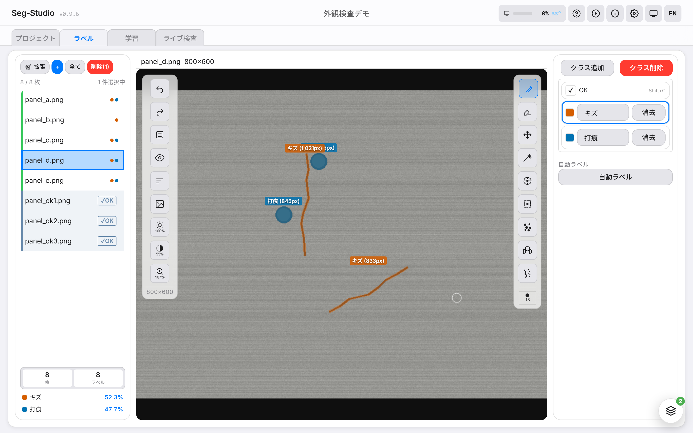
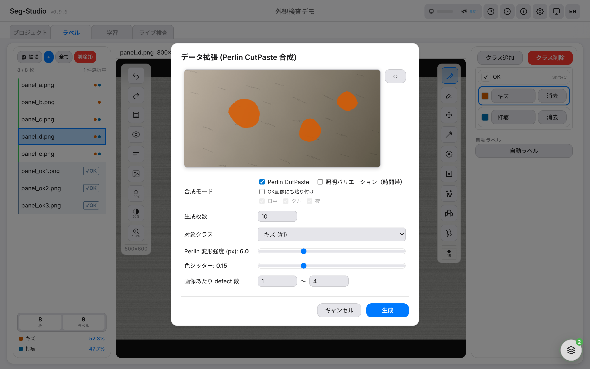
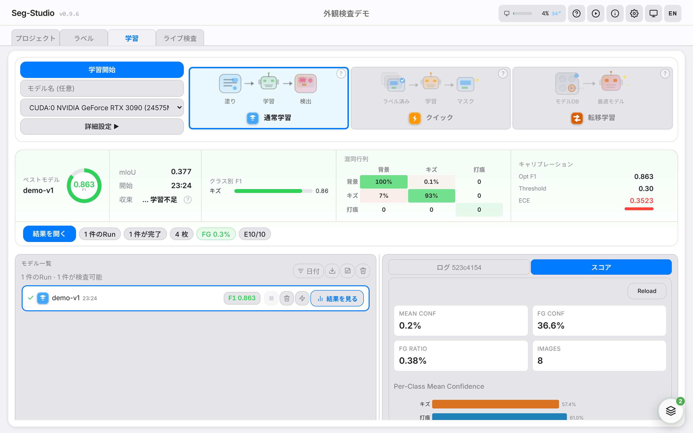
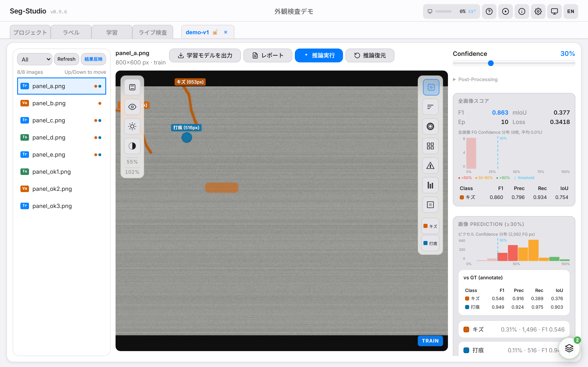
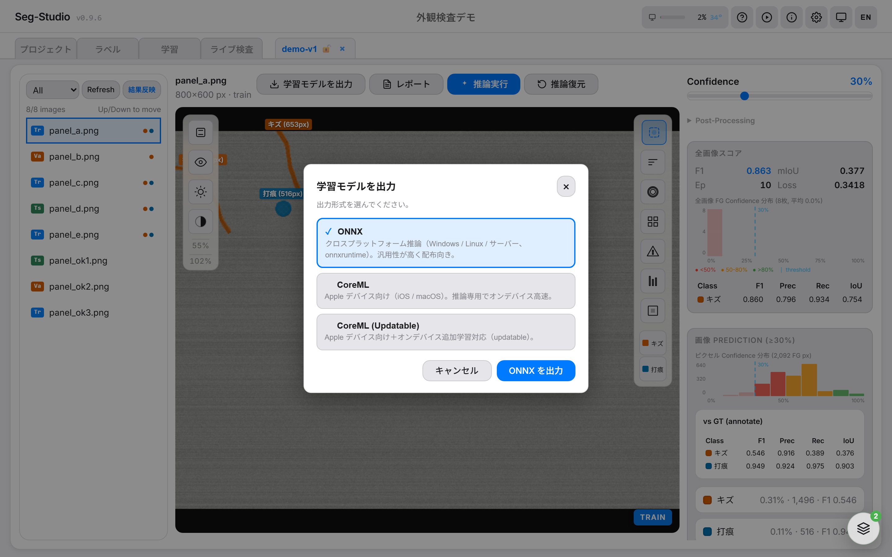

# Seg-Studio 機能カタログ

> **画像セグメンテーションをオールインワンで** — アノテ、学習、評価、配布まで 1 つのツールで完結。

---

## 🖊 アノテーション

| 機能 | できること | バッジ |
|---|---|:---:|
| ブラシ / ワンド / 消しゴム | 基本の描画ツール一式 | 標準 |
| 🆒 **SAM マーキング** | クリック 1 発で対象を自動抽出 (Meta SAM 内蔵) | 目玉 |
| クラック追跡 | クリックで候補を自動トレース → 選んで確定 | 便利 |
| スポット検出 | DoG ベースの点状欠陥検出 | 便利 |
| Superpixel 選択 | 似た領域でクリック 1 発塗り | 便利 |
| Move ツール | 既存マスクをドラッグで平行移動 | 便利 |
| **Mark Clean** | OK 画像をワンクリックで学習データ化 | 目玉 |

---

## 🧪 データ拡張

| 機能 | できること | バッジ |
|---|---|:---:|
| 🆒 **Perlin CutPaste 合成** | 既存欠陥を歪ませてランダム位置に貼り付け | 目玉 |
| 🆒 **Lighting バリエーション** | 日中 / 夕方 / 夜 の色温度で屋外対応 | 目玉 |
| Auto-config | データ特性から最適設定を自動推薦 | 便利 |
| Annotation Patches | 重心ベースの効率的パッチサンプリング | 標準 |

---

## 🎓 学習

| 機能 | できること | バッジ |
|---|---|:---:|
| 学習モード | 通常学習 / クイック / 転移学習 を選んで開始 | 標準 |
| ローカル GPU 学習 | そのままの PC で学習 | 標準 |
| 転移学習 | 過去 run のチェックポイントを指定して追加学習 | 便利 |
| 🆒 **DINOv2 特徴蒸留** | 142M 画像で学んだ教師から特徴を蒸留 | 目玉 |
| Lovász-Softmax Loss | 境界が効くロス関数の選択可 | 便利 |
| 多様なアーキテクチャ | SimpleUNet / STDC / DeepLabV3+ | 標準 |
| Deep Supervision | 補助ロスで中間層も学習 | 標準 |

> 異常検知 (OK 画像のみからの学習) は Seg-Studio のスコープ外としました。
> 姉妹プロジェクト **AnomaLens** (産業向け外観異常検知、公開準備中) が担当します。

---

## 📊 評価・可視化

| 機能 | できること | バッジ |
|---|---|:---:|
| メトリクス一覧 | F1 / mIoU / Precision / Recall | 標準 |
| ヒートマップ | 信頼度を色で可視化 | 便利 |
| **CCA 分析** | 検出領域の数・サイズ分布 | 便利 |
| **Pattern Overlay** | 欠陥のみを抽出して背景に重畳 | 便利 |
| 🆒 **ライブ検査** | カメラ映像にリアルタイム推論 | 目玉 |
| しきい値スライダ | Confidence 閾値を即座に変更 | 便利 |
| Batch Export | 全画像の推論結果を一括書き出し | 便利 |

---

## 📦 配布・エクスポート

| 機能 | できること | バッジ |
|---|---|:---:|
| ONNX エクスポート | Python/C++ サーバー推論向け | 標準 |
| CoreML エクスポート | iOS / macOS アプリ組み込み | 標準 |
| 🆒 **CoreML Updatable** | iOS 上でオンデバイス再学習可能 | 目玉 |
| OpenVINO エクスポート | FP32/FP16/INT8、Intel CPU/iGPU/NPU 向け | 便利 |
| Python SDK | `pip install` ですぐ使える | 標準 |
| REST API | `/v2/infer` で単発推論 | 標準 |
| 🆒 **WebSocket 推論** | 連続フレームで低遅延ストリーミング | 目玉 |

---

## 🔧 UX / 運用

| 機能 | できること | バッジ |
|---|---|:---:|
| 日本語 UI | すべて日本語化済み (英語切替可) | 標準 |
| 大画像タイル表示 | 8K 画像もストレスなく閲覧 (DZI) | 便利 |
| 複数プロジェクト管理 | ダッシュボードで一覧・切替 | 標準 |
| 動的バッチアップロード | ファイルサイズから最適化 | 便利 |
| ハンズオンチュートリアル | 画面上で操作案内 | 便利 |

---

## アイコン凡例

| バッジ | 意味 |
|:---:|---|
| 目玉 | Seg-Studio の差別化機能 |
| 便利 | 生産性を上げる機能 |
| 標準 | 業界標準的な機能 |
| 🆒 | 特にアピールしたい目玉機能 |

---

## 資料リンク

- 📘 [はじめてのハンドブック](handbook.md) — 14 章の通しワークフロー
- 📖 [ユーザーガイド（詳細版）](user-guide.md)
- 🛠 [トラブルシュート](troubleshooting.md)
- 💻 [開発者向けクイックスタート](dev-quickstart.md)

---

_Seg-Studio Catalog v1.0 — 2026-04_
