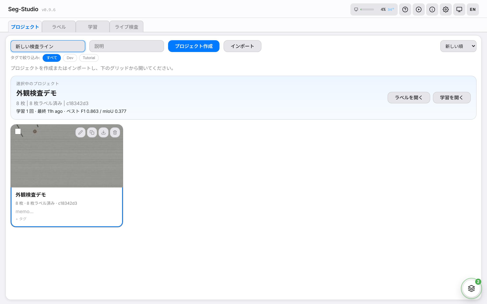
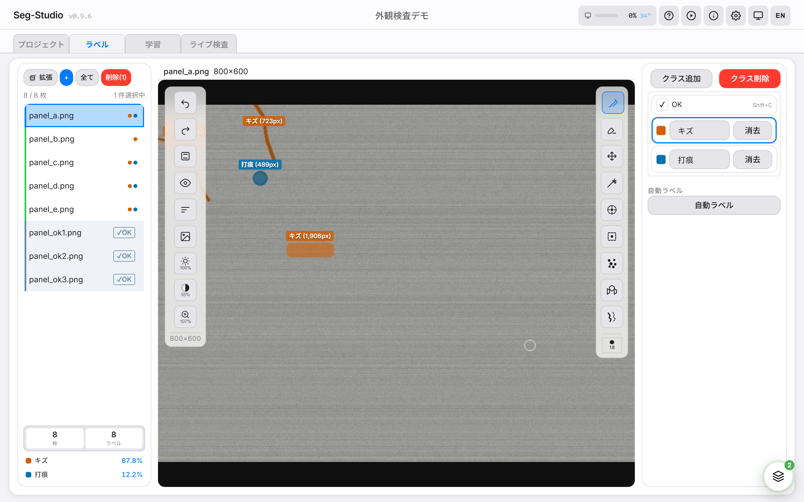
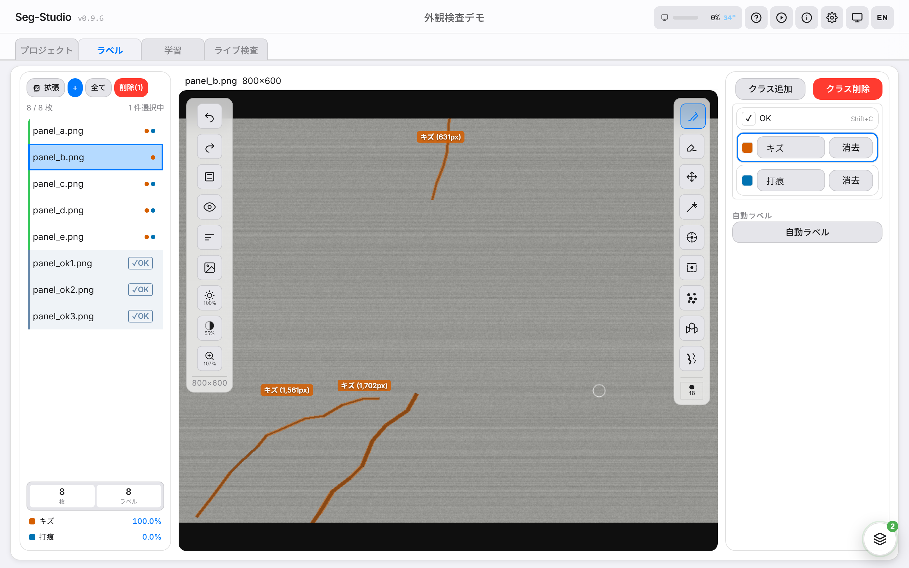
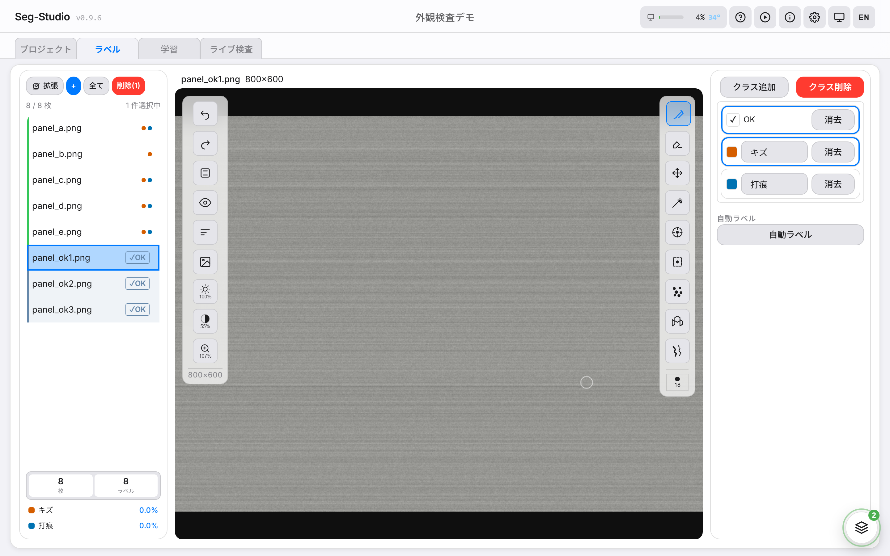
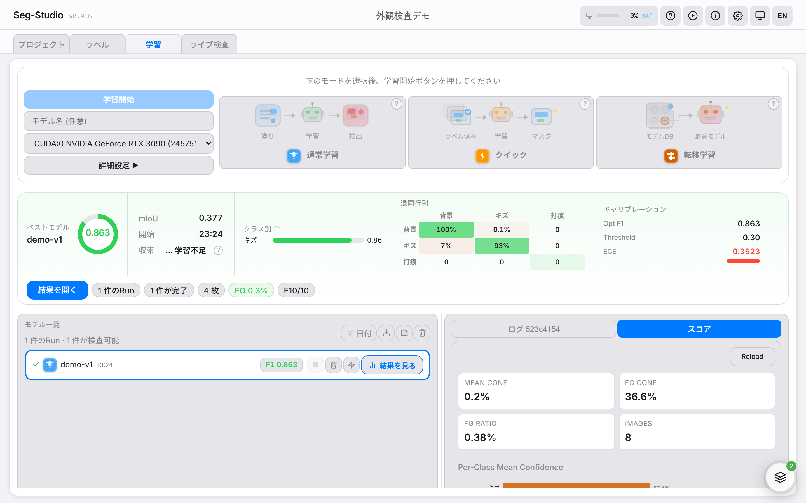
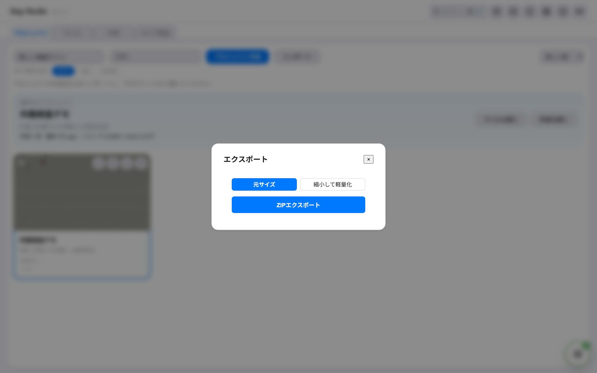

# Seg-Studio はじめてのハンドブック

> **この文書の位置づけ:** サンプルデータを 1 本通して、画像の取り込みからアノテーション・
> 学習・エクスポート・推論までを順番に体験するチュートリアルです。応用機能もこの流れの中で
> 扱います。最短で結果を出したい場合は [はじめてのファーストラン手順](first-run-manual.md)、
> 機能ごとに調べたい場合は [ユーザーガイド](user-guide.md) をご覧ください。

このハンドブックは **Seg-Studio をまったく触ったことがない方** が、
画像を集める → アノテート → 学習 → 推論 まで一気通貫で体験できるように書かれた
「16 章の通しワークフロー」です。1〜14 章が画像から推論までの基本の流れで、
15〜16 章は個数カウントを扱う任意の追加章です。

各章の目安:

- **⏱ 所要時間**: 1 つあたり 3〜15 分
- **📸 スクリーンショット**: 現在 7 枚。残りは `contributing/screenshots.ja.md` に撮影リストがあります
- **🎯 ゴール**: 画像 → モデル → 推論結果まで 1 本の流れを掴む

> 💡 サンプル題材は `SIM` プロジェクト（クラス = キズ / シミ、画像 163 枚）
> を使って説明します。読み替えれば屋外検査でもピッキングでも同じ流れです。

---

## もくじ

1. [ようこそ](#1-ようこそ) — Seg-Studio でできること
2. [起動と画面構成](#2-起動と画面構成) — タブとボタンの役割
3. [プロジェクトを作る](#3-プロジェクトを作る) — 新規作成から
4. [画像を入れる](#4-画像を入れる) — D&D / 動画フレーム抽出
5. [クラスを決める](#5-クラスを決める) — 何を検出したいか
6. [アノテーションする](#6-アノテーションする) — 🆒 **SAM マーキング** などの特徴機能
7. [OK 画像を Mark Clean](#7-ok-画像を-mark-clean) — 欠陥なし画像の扱い
8. [データ拡張で水増し](#8-データ拡張で水増し) — 🆒 **Perlin CutPaste / Lighting**
9. [データを準備する](#9-データを準備する) — train / val / test 分割
10. [学習設定を決める](#10-学習設定を決める) — Auto-config 推奨値
11. [学習を動かす](#11-学習を動かす) — 進捗をライブ監視
12. [結果をじっくり見る](#12-結果をじっくり見る) — ヒートマップ / CCA / Live inspection
13. [モデルを書き出す](#13-モデルを書き出す) — 🆒 **CoreML Updatable**
14. [SDK で推論する](#14-sdk-で推論する) — Python で呼び出し
15. [個数カウント (インスタンスモード)](#15-個数カウント-インスタンスモード) — 🆕 インスタンスアノテ不要の正確カウント
16. [カウント API](#16-カウント-api-post-count) — 🆕 `POST /count`: 個数・重心・RLE

---

## 1. ようこそ

Seg-Studio は **画像セグメンテーション（= 画素単位の欠陥検出）** を
「集める → アノテート → 学習 → 推論」 までオールインワンでこなす GUI ツールです。

### こんな人におすすめ

- 目視検査を AI で半自動化したい
- Python にあまり慣れてない
- でも結果は業務に使えるレベルで欲しい

### 他ツールとの違い
| 機能 | Seg-Studio | 典型的な他ツール |
|------|:---:|:---:|
| ブラウザで完結 | ✅ | |
| SAM ワンクリック抽出 | ✅ | 一部あり |
| Perlin CutPaste 合成 | ✅ | ほぼなし |
| 屋外用 Lighting 拡張 | ✅ | なし |
| CoreML Updatable 出力 | ✅ | なし |
| 日本語 UI | ✅ | 多くはない |


> **ポイント**: 「タブを左から右に進めば AI モデルができあがる」
> という設計思想です。迷ったら左から順。

---

## 2. 起動と画面構成

### 起動方法

```bash
# Windows
scripts\windows\start_local_windows.bat

# macOS
bash scripts/macos/start_local_macos.sh
```

API の起動が完了すると、ブラウザが自動で `http://localhost:8002/ui/` を開きます。

### 画面のタブ構成
| タブ | 何をするところ |
|---|---|
| **プロジェクト** | プロジェクト一覧・切り替え |
| **ラベル** | 画像にマスクを塗る |
| **学習** | 学習の設定と実行 + 結果確認 (完了後 Run ごとに結果タブが開く) |
| **ライブ検査** | カメラ接続でリアルタイム推論 |

> **ポイント**: 右上の⚙️アイコンから設定メニューに入れます。
> 多くは既定値のままで OK。

---

## 3. プロジェクトを作る

「プロジェクト」= 画像・マスク・学習結果をひとまとめにした作業単位です。

### 手順

1. **プロジェクト** タブ を開く
2. プロジェクト名欄に名前を入れる（例: `SIM`）
3. **「プロジェクト作成」** をクリック



### 既存プロジェクトとの違い

- ID が自動で振られ、裏では `projects/{id}/` に保存される
- **名前はあとから変更可能**、ID は変わらない

> **落とし穴**: 同名プロジェクトを作っても ID が違うので別扱い。
> 切り替えは一覧から選択。

---

## 4. 画像を入れる

### 方法 A: ドラッグ&ドロップ（おすすめ）

- **ラベル** タブ → 左の画像リスト欄にフォルダごと D&D
- 1 枚〜数千枚まで対応
- 容量の大きなファイルは自動で分割アップロード

> **ポイント**: 画像サイズから最適なバッチサイズが自動決定されるので、
> 設定はさわらなくて OK。Places365 のような 256px 画像なら **100 枚/リクエスト** で送られます。

### 方法 B: 動画からフレーム抽出

- D&D で動画ファイル (mp4 等)
- 「何フレームに 1 枚抽出？」を指定
- 自動でデコード → 画像化

### 方法 C: ZIP インポート

過去プロジェクトを丸ごと復元したいときに。

---

## 5. クラスを決める

「何を検出したいか」のラベル設計です。

### 例（SIM プロジェクト）
| ID | 名前 | 色 |
|---:|---|---|
| 0 | 背景 | 黒 |
| 1 | キズ | 赤 |
| 2 | シミ | 緑 |



### ポイント

- **ID 0 は必ず背景**。変更しないでください
- クラス数が多すぎるとアノテ負荷が爆増 → **3〜5 クラスが実用**
- 似たような欠陥はまとめていい。細かく分けて学習が割れるよりマシ

---

## 6. アノテーションする

### 6-a. ブラシ / ワンド の基本



- **ブラシ** (`B`): マウスドラッグで塗る。`[` `]` でサイズ変更
- **ワンド** (`W`): クリックで類似色を自動選択 → 塗りつぶし
- **消しゴム** (`E`): なぞって消す

### 6-b. 🆒 SAM マーキング（特徴機能）

Meta の SAM (Segment Anything) モデルを内蔵。**クリック 1 発で対象抽出** できます。

#### 使い方

1. SAM ツール（🪄アイコン）を選択
2. 欠陥領域を **左クリック** → 正例点
3. 欠陥じゃない場所を **右クリック** → 負例点。**既定では無効**なので、先に右上の
   ⚙️ 設定ダイアログで **「SAM の除外クリック（右クリック）を有効にする」** を ON に
   してください（OFF のままだと右クリックは無視されます）
4. Enter で確定

#### ここがすごい

- 最初の読み込みだけ 10 秒、以降はクリック即反応
- 細かい境界が自動で抜かれる → ブラシ作業が 10 倍速い

### 6-c. クラック追跡 / スポット検出

- **クラック追跡** (`C`): 線状欠陥をクリック → 候補が自動トレースされるのでクリックで選択、Enter で確定
- **スポット検出** (`D`): DoG (Difference of Gaussians) ベースの点状欠陥検出。サンプルを塗って **検出** → 感度を調整 → Enter で確定
- **Superpixel** (`P`): 似た領域で分割 → 1クリックで大きな塊を選択

### 6-d. 保存と Undo

- `Ctrl + Z` / `Ctrl + Y` で Undo/Redo
- 保存はタブ切替や画像移動で自動
- 明示保存は `Ctrl + S`

---

## 7. OK 画像を Mark Clean

「欠陥が写っていない普通の画像」も学習には **めちゃくちゃ大事** です。

### Mark Clean とは

画像に **空のマスク（全部 0）** を付けて「ここは OK」とモデルに教える機能。

### 手順

1. 画像リストで OK 画像を複数選択（Shift クリックで範囲選択）
2. **OK ボタン** をクリック（`Shift+C` でも可）



### 屋外用途での使い方（実例）

屋外のハンドヘルドカメラの場合、背景が多種多様で FP（誤検出）が出やすい。
対策として **Places365 のような一般屋内外シーン画像** を投入 → 全 Mark Clean
すると、モデルが「こういうシーンは全部 OK」と覚えてくれます。

> **ポイント**: Mark Clean の比率は train 全体の **30〜50%** くらいが安全。
> 入れすぎると Recall が落ちます。

> **落とし穴**: Mark Clean 済みかどうかは OK バッジで判別可能。
> 付け間違えは OK ボタンの隣の **「OK消去」** で戻せます。

---

## 8. データ拡張で水増し

### 8-a. 🆒 Perlin CutPaste 合成

既存のアノテ画像からランダムに欠陥を切り出し、別の場所に **Perlin ノイズで歪ませて** 貼り付ける拡張。

#### 使い方

1. ラベル タブの **拡張** ボタン
2. 「Perlin CutPaste」にチェック
3. **対象クラス** を選択（複数クラスなら "全クラス"）
4. 枚数・変形強度を調整
5. **生成** → 数秒で新しい合成画像が追加される

### 8-b. 🆒 照明バリエーション（屋外専用）

同じシーンを **日中 / 夕方 / 夜** の色温度に変換して水増し。

#### 使い方

1. 拡張ダイアログで **照明バリエーション** にチェック
2. 日中 / 夕方 / 夜 から好きな組み合わせを選択
3. Perlin と併用可能（同時に 2 系統の拡張）

> **ポイント**: 屋外データは元画像が少ないことが多いので、
> これだけで **学習枚数 3 倍** になります。

---

## 9. データを準備する

### Prepare Dataset とは

集めた画像を **train / val / test** に分割し、学習用のファイル構造に整える工程。

### 現在の動き

ボタン操作は不要です。**「学習開始」を押すと自動的に分割が実行** され、
Run 一覧に「データセット準備中...」→「データセット準備完了 (train=…, val=…)」と
経過が表示されます。

分割比（既定: val 15%、test 10%）を変えたい場合は、右上の **⚙️ 設定** で
**Validation Ratio / Test Ratio** を調整してください。

### 学習用コピーは可逆です（既定は PNG）

データセット準備は、各画像の学習用コピーを `prepared/images/` に **PNG**（元画像と
バイト単位で同一）で書き出します。再エンコードは行わないため、学習が見る画素は撮影した
画素そのままです。その分 prepared フォルダは大きくなります。

**容量とデコード速度を優先する場合。** JPEG 品質 95 はオプトインです。prepared フォルダが
ディスクに収まらない場合や、画像のデコードが GPU の足を引っ張っている場合にだけ:

```
SEG_PREPARED_IMAGE_FORMAT=jpeg
```

を設定してデータセット準備をやり直してください。**4:4:4**（色差の間引きなし）の q95 JPEG
で書き出され、実際の 20 MPix 検査画像では PNG と比べて **おおよそ 3.6 倍小さく**なります
— 旧既定の 4:2:0 では同じ画像で 5.9 倍でしたが、4:4:4 ではバイト数がほぼ倍になります。

**JPEG を選んだときの代償。** 同じ画像で、欠陥領域の平均絶対誤差は **約 2.7 / 255**。
**背景も約 2.7** なので、欠陥だけを選んで潰しているのではなく、一様な量子化ノイズが
乗っているだけです。ただしこの計測は欠陥が画面の約 42% を占める画像でのものです。
**1〜2 画素幅の欠陥や、極めて低コントラストの欠陥**が対象なら、信号対量子化比は大幅に
悪化します。しかも**スコアには現れません** — 学習も評価も再エンコード後のコピーを読み、
推論だけが元ファイルを読むためです。色差だけの欠陥が減衰しないのは 4:4:4 で書き出すため
で、libjpeg 既定の 4:2:0 では 1 画素幅の色線のコントラストが **16.25 → 5.21** まで
落ちます（4:4:4 なら 16.25 → 16.21）。

実際に使われた形式は `prepared/report.json` の `prepared_image_format` に記録されます。

### Stratified Split の仕組み（重要）

- **前景あり画像** と **Mark Clean 画像** を **別プールで分割**
- Val / Test に両方が同じ比率で入る
- → Mark Clean 画像だけで val が埋まり、F1 = 0 になる事故を防止

> **この分割はグループを認識しません。** 画像ファイル名の SHA1 順で並べて切るだけなので、
> 撮影セッション・ロット・ワークとは無関係な並びになります。同一ワークの連写や、同じ部品を
> 角度違いで撮った画像が train と val の両方に入り得ます。**ほぼ同一の画像が train と val に
> またがると、val スコアは実力より良く出ます。** そうしたグループを含むデータでは、画像ごとの
> **train / test** 指定を自分で付けて、グループ全体を片側に寄せてください。指定した枚数は
> `report.json` に `manual_train_count` / `manual_test_count` として、グループ非対応である
> ことは `split_grouping: "none"` として記録されます。

---

## 10. 学習設定を決める

### まず学習モードを選ぶ

学習 タブには 4 つのモードボタンがあります — **通常学習**（アノテして学習）、
**クイック**（ラベル済み画像で素早く学習）、**転移学習**（既存モデルをベースに学習）、
**個数カウント**（セマンティックマスクから物体の個数を数える — 15 章）。
**モードを選ぶまで「学習開始」ボタンは押せません。** この通しでは **通常学習** を選びます。

### Auto-config 推奨値

画像枚数 / 欠陥サイズから `arch` / `patch_size` / `base_channels` を推定して表示します。
**迷ったらこの値で OK**。

### 手動設定（慣れてきたら）
| 項目 | 目安 |
|---|---|
| arch | simpleunet (デフォルト、小さく高速) / stdc (ライブラリ 37 project 中 15 で best) |
| patch_size | 256（ライブラリ 37/37 project で best。128/512 が勝った project はゼロ） |
| output_stride | 2 or 4（細かい境界は 2） |
| epochs | 50〜100（early stopping で適宜止まる） |
| 転移学習 | **ON 推奨**（既存プロジェクトから初期値取得） |



---

## 11. 学習を動かす

### ローカル GPU

- **学習開始** ボタン → NVIDIA CUDA GPU で学習（学習には CUDA GPU が必要）
- 進捗グラフで loss / F1 / mIoU が逐次更新
- Epoch ごとに自動保存

---

## 12. 結果をじっくり見る

### メトリクス

- **F1**: 最も重要。同じデータセットのラン同士で比較する。普遍的な合格ラインは無い
- **mIoU**: F1 が高いのに mIoU が低い → 境界が甘い可能性
- **Precision / Recall**: FP 多い？ FN 多い？ の判断材料

### 可視化
| 機能 | 使いどき |
|---|---|
| **ヒートマップ** | どこで高確信 / どこが怪しいか |
| **CCA (連結成分分析)** | 検出領域の数・サイズ分布 |
| **Pattern overlay** | 欠陥だけを背景に重ねて視認 |
| **Live inspection** | カメラ映像にリアルタイム推論 |

### しきい値の調整

右のスライダーで **推論時の confidence しきい値** を変えると、FP/FN のトレードオフが即座に見えます。

---

## 13. モデルを書き出す

### エクスポート形式
| 形式 | 用途 |
|---|---|
| **ONNX** | サーバー推論、Python/C++ で使う |
| **CoreML** | iOS / macOS アプリに組み込み |
| **🆒 CoreML Updatable** | **iOS 上でオンデバイス再学習** できる特殊形式 |
| **OpenVINO** (FP32/FP16/INT8) | Intel CPU / iGPU / NPU でのエッジ推論 |



### 手順

1. 学習 タブの学習済み Run を選び、**結果を見る** で結果タブを開く
2. **学習モデルを出力** をクリックし、ONNX / CoreML / CoreML (Updatable) から形式を選んで実行
3. DL リンクから `.onnx` / `.mlmodel` を取得

> **OpenVINO だけは別**: 学習 タブの Run の OpenVINO メニューから FP32 / FP16 / INT8 を選ぶ。

> **ポイント**: CoreML Updatable は最終 Conv レイヤだけを iOS 側で再学習できる
> ため、現場でユーザーごとに微調整するアプリに便利。

---

## 14. SDK で推論する

Python から HTTP/WebSocket で呼べる **seg-sdk** が同梱されています。

### インストール

```bash
pip install ./packages/seg-sdk
```

### 最小コード（5 行）

```python
from seg_sdk import SegClient

client = SegClient("http://localhost:8002")
client.start_session(project_id="your-project-id", run_id="your-run-id")
result = client.predict(open("frame.jpg", "rb").read())
print(result.judgement, "| 重心:", [r.centroid for r in result.regions])
```

### 得られる情報
| フィールド | 内容 |
|---|---|
| `judgement` | `"OK"` / `"NG"` |
| `regions[i].bbox` | バウンディングボックス `(x, y, w, h)` |
| `regions[i].centroid` | 重心座標 `(cx, cy)` ← ロボット制御に便利 |
| `summary.fg_ratio` | 欠陥ピクセル比率 |
| `latency_ms.total` | サーバ側処理時間 |

詳しくは [`packages/seg-sdk/README.ja.md`](../../packages/seg-sdk/README.ja.md) 参照。

---

## 15. 個数カウント (インスタンスモード)

画像の中のねじ・部品・錠剤が **何個あるか** を知りたい。しかも触れ合っていたり
重なっていたりする — インスタンスモードは、**すでに塗ってあるセマンティックマスクから**
RF-DETR-Seg のカウントモデルを学習します。**1 個ずつのアノテーションは一切不要**です。

### しくみ

塗ったマスクを物体ごとの切り抜きに分解し、そこから合成学習データを作ります。
コピー&ペーストで、1 個ずつの正解が厳密に付いた画像を生成します。**同軸で
接触したペア** も含めます — カウントモデルが最も苦手とするケースだからです。

検証には**学習合成に一度も使っていない元画像**を必ず使い、カウント閾値は学習後、
**実際に書き出されるチェックポイント**に対して校正します。

**アクティブなクラスは全部カウントされます。** 対象を 1 つ選ぶ必要はありません。
モデルが全クラスを学習し、クラスごとの個数を返します。

### 手順

1. いつも通りセマンティックマスクを塗ります (6 章)。対象クラスが写った画像が
   **4 枚** で下限、それ以上あるほど良くなります。足りているかは下のプレビューで
   確認できます。
2. **学習** タブで **個数カウント** のモードカードを選びます。
3. 合成の設定を変えたい場合は **詳細設定** を開きます (1 枚あたりの物体数、
   スタックペア率、単体面積帯 — `0` で自動)。プレビューの **生成** を押すと
   合成サンプルを数枚確認できます。
4. 学習を開始します。既定は **Small**、**Medium** は明確に精度が上がり、3 つ目の
   サイズとして **Large** も選べます。VRAM が小さい環境で自動調整されるのは
   Small / Medium だけで (バッチを半分にして gradient accumulation を倍にし、実効
   バッチを保ちます)、Small の下限は約 3.5 GB です。**Large は実測値が無いため自動
   調整の対象外**で、指定したバッチのまま実行され OOM することがあります。その場合は
   手動でバッチを下げてください。

   | サイズ | batch 8 | batch 4 | batch 2 |
   |--------|---------|---------|---------|
   | Small | 8.0 GB | 5.5 GB | 3.5 GB |
   | Medium | 16.0 GB | 9.5 GB | 6.0 GB |

5. **結果** タブで推論します。オーバーレイは 1 個ずつ番号を振り、ヘッダに
   クラス別の個数が出ます。**検出ハイライト** に切り替えると背景が暗くなり
   個体ごとに色が変わるので、**接触した 2 個が 1 個として数えられていないか**
   を最も速く確認できます。
6. **エクスポート → ONNX (Serving)** でモデルを登録します。有効化後、
   serving API の `POST /count` が画像ごとの個数を返します (16 章)。

### 大きい画像は自動でタイル分割されます

検出器の入力サイズは固定なので、写真全体を渡すと縮小されます。**2560px の
フレームにある 110px のねじは 18px になって届きます** — ほとんど失われます。

そこで学習は **撮影解像度のまま 768×768 のパッチ**を合成し、推論も同じ 768 の
パッチで画像を走査して、検出をつなぎ合わせます。

実際の 2560×2048 プロジェクトで、写真 4 枚をアノテーションと突き合わせた実測
(真値は各 40 個):

| | タイル数 | カウント | 平均誤差 | 時間 |
|---|---|---|---|---|
| patch 384 | 63 | 36, 36, 36, 36 | 4.0 | 1.6 秒 |
| **patch 768** (既定) | 20 | 40, 40, 40, 40 | **0.0** | **0.5 秒** |

真値は各 40 個で、この表の以前の版が書いていた「39, 39, 40, 39」は誤りでした。
4 枚のうち 3 枚には接触したねじのペアが写っており、アノテーションはそれを 1 つの
領域として記録します。領域数で数えると、その 3 枚が 1 個ずつ少なく出ます。

**この機能に設定は不要です。** 768 より小さい画像はパディングして 1 パッチとして
扱われ、タイル分割が無かった頃と同じ挙動になります。512px の写真のプロジェクトは
今まで通りです。大きいフレームだけがタイル分割されます。

変更したい場合、`instance_patch_size` に画素サイズ (0〜4096) か `0` (タイル分割オフ) を
指定できます。既定の 768 は Small の入力 384 の 2 倍です。選んだ値は書き出す契約に
記録されます。**学習と推論は必ず同じパッチサイズでなければならない**ためです —
食い違ってもエラーにはならず、カウントだけが狂います。

### 得意・不得意

- **合成ベースは「分離した硬い部品」で最も効きます** (ねじ、ピン、プレス部品)。
  大きく変形するものや、密に積み上がったものは、実アノテーション画像がもっと
  必要になることがあります。プレビューを見てください — 合成サンプルが実際の
  シーンと似ていなければ、面積帯を調整するか、アノテーションを増やしてください。
- **モデルのクエリ数**が 1 回の推論で出せる検出数の上限です (全クラス共通)。値は
  書き出したモデルが持つもので、200 固定ではありません。これが 1 枚全体の上限になるのは
  タイル分割オフ (`instance_patch_size` 0) のときだけで、既定のタイル分割では
  タイルごとに上限を持ちます。タイル分割なしのモデルでは、上限の 90% を超えると
  自信のある数字を返す代わりに **取りこぼし警告** が付きます。フレームを分割するか、
  切り出し範囲を狭めてください。
- **タイルのオーバーラップより大きい物体**は継ぎ目にまたがることがあります。
  既定の 768 パッチではオーバーラップが 192px なので、それ未満なら安全です。
  大きい物体にはより大きいパッチが要ります。

---

## 16. カウント API (`POST /count`)

serving レジストリでカウントモデルを有効化すると、`POST /count` が画像 1 枚を
受け取って結果を返します。CPU で動作し、GPU は不要です。

```bash
curl -F "image=@tray.png" http://localhost:8001/count
```

```json
{
  "model_id": "b42d4695-...",
  "count": 40,
  "counts_by_class": {"1": 38, "2": 2},
  "class_names": {"1": "screw", "2": "washer"},
  "threshold": 0.3,
  "dedup_iou": 0.7,
  "image_size": [2560, 2048],
  "inference_time_sec": 0.52,
  "instances": [
    {
      "id": 1,
      "class_id": 1,
      "class_name": "screw",
      "conf": 0.9812,
      "bbox": [412, 233, 118, 121],
      "centroid": [470.4, 293.1],
      "area": 8842,
      "rle": {"size": [2048, 2560], "counts": []}
    }
  ]
}
```

| フィールド | 意味 |
|---|---|
| `count` | 全クラス合計の個数 |
| `counts_by_class` | クラス別の個数 (キーはプロジェクトのクラス ID) |
| `bbox` | 元画像の画素座標で `[x, y, 幅, 高さ]` |
| `centroid` | マスクの**面積重心** (1 次モーメント)。箱の中心ではありません — ピッキング用途にはこちらを使ってください |
| `area` | マスクの画素数 |
| `rle` | COCO 非圧縮 RLE (列優先)。学習側が書き出すものと同じ形式 |
| `threshold` / `dedup_iou` | モデルが校正された値。呼び出し側が記録できるよう返しています |

### 個数が足りない可能性があるとき

検出器が 1 回の推論で出せる検出数は、そのモデルが持つクエリ数が上限です (全クラス共通)。
200 固定ではなく、serving は有効化したモデルのエクスポートからその値を読み取って返します。
上限に近づくと、レスポンスに次が追加されます。

```json
"truncation_warning": "191 instances is close to this model's per-image limit of 200; the real count may be higher",
"max_instances_per_image": 200
```

これは「191 個」ではなく「**191 個以上**」として扱ってください。フレームを分割するか、
切り出し範囲を狭めてください。

**この警告が付くのはタイル分割なしのモデルだけです。** パッチ学習済みモデル
(`instance_patch_size` の既定が 768 なので通常はこちら) は画像をタイル分割し、タイルごとに
クエリ上限を持つため、1 枚あたりの上限という概念が無くなり上記のキーは返りません。ここで
説明した挙動が必要なら、学習時に `instance_patch_size` を 0 にしてください。

### 閾値が未校正のとき

信頼度の閾値は、学習時にアノテーション済みの validation 画像を候補値ごとに
数えて決めます。そのため validation 側にアノテーション済み画像が最低 1 枚必要で、
無い場合は既定値のまま出荷され、レスポンスにその旨が出ます:

```json
"threshold_warning": "threshold 0.3 was not calibrated: the training run had no annotated validation image to measure against, so this is the default. Counts may be systematically high or low."
```

よくある原因は、アノテーション済み画像がすべて単体面積帯から外れた領域を
含んでいたことです。物体を 1 個ずつ別の領域として塗った画像を 1 枚追加して、
学習し直してください。

### エラー

| ステータス | 意味 |
|---|---|
| 503 | モデルが有効化されていない |
| 409 | 有効なモデルがセマンティックセグメンテーション用 — `/segment` を使ってください |

---

## おつかれさまでした 🎉

ここまでで **画像 → モデル → 推論結果** の一通りができるようになりました。

### 次のステップ

- ✅ 自分の業務画像で同じ流れを 1 回通す
- ✅ [カタログ](catalog.md) で他の便利機能を俯瞰する
- ✅ FP が多い場合は Mark Clean を増やしてみる
- ✅ 精度を詰めたい場合は Auto-config ではなく手動チューニング

### 困ったときは

- [トラブルシュート集](troubleshooting.md)
- [ユーザーガイド（詳細版）](user-guide.md)
- [開発者向けクイックスタート](dev-quickstart.md)

---

_Seg-Studio Handbook v1.0 — 2026-04_
