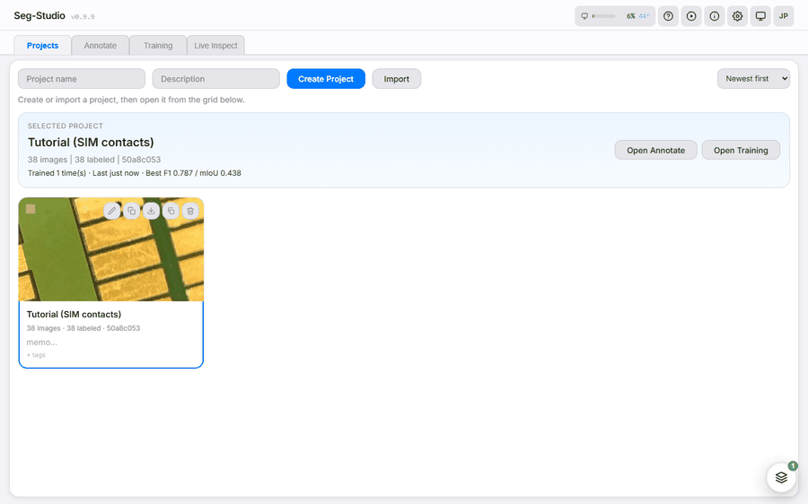

# Seg-Studio

**アノテーション・学習・エクスポートを、すべて手元のマシンで。**

Seg-Studio は、セマンティックセグメンテーションのためのオールインワン
GUI ツールです。Windows / macOS 上でローカルアプリとして動作し、SAM 支援の
アノテーション、PyTorch によるモデル学習、ONNX / CoreML へのエクスポートまでを
1 つの画面で行えます。クラウドアカウントも画像のアップロードも不要で、
データと学習済みモデルは実行したマシンから出ません。

セグメンテーションに加えて、**アノテーション済みのマスクを再利用した個数カウント**にも
対応しています。カウント用に別途アノテーションをやり直す必要はありません。

現在のリリース: **v0.9.8 (beta)** · Apache-2.0 ·
[ダウンロード](https://github.com/segmen-pixel/seg-studio/releases/latest) ·
[ソース](https://github.com/segmen-pixel/seg-studio) ·
[English](../)

## どこから読むか

| 目的 | ページ |
|---|---|
| はじめて使う | [初回セットアップ手順](../docs/ja/first-run-manual.md) — インストールから最初の推論まで約 10 分 |
| 機能を 1 つ調べたい | [ユーザーガイド](../docs/ja/user-guide.md) — 各タブ・ツール・設定のリファレンス |
| ひと通り理解したい | [ハンドブック](../docs/ja/handbook.md) — サンプルデータで最初から最後まで、全 16 章 |
| インストールで詰まった | [トラブルシューティング](../docs/ja/troubleshooting.md) |
| 共有マシンや LAN で使う | [デプロイガイド](../docs/ja/deployment.md) |
| 開発に参加したい | [開発者向けクイックスタート](../docs/ja/dev-quickstart.md) |

## 主な機能

- **SAM 支援アノテーション** — クリックでの領域抽出、ブラシ、ポリゴン、クラス管理、
  オートセーブ。マスクはインデックス付き PNG なので、他ツールへ持ち出せます
- **コードを書かない学習** — タスクを選ぶとバックボーン・エポック数・augmentation・
  学習率がレシピとして自動決定されます。各項目は後から手動で上書きできます
- **学習中のライブ監視と評価** — loss / 指標の推移、画像ごとの F1・適合率・再現率・IoU、
  信頼度分布、ヒートマップ表示による判断根拠の確認
- **個数カウント** — 既存のマスクからインスタンス数を算出
- **エクスポート** — ONNX / OpenVINO IR / CoreML。エッジデバイスや iPhone、
  Seg-Studio を入れていない PC でも推論できます
- **オフライン動作** — クラウドアカウント不要、テレメトリなし、画像の外部送信なし

機能の一覧は[機能カタログ](../docs/catalog.md)、実測値は
[ベンチマーク](../BENCHMARKS.md)を参照してください。

## インストール

ZIP をダウンロードして `install` → `start` を実行し、ブラウザで
`http://localhost:8002/ui/` を開くだけです。Windows / macOS それぞれの
コマンドは [README (日本語)](../README.ja.md) に、そこから学習までの流れは
[初回セットアップ手順](../docs/ja/first-run-manual.md)にあります。

Python 3.10 以降が必要です。CUDA GPU があれば学習は大幅に速くなりますが必須では
なく、CPU でも学習できます。Apple Silicon は MPS 経由で対応しています。

## リファレンス

- [インポート / エクスポート形式仕様](../docs/ja/import_export.md)
- [Auto-Select 技術ノート](../docs/ja/technical_note_auto_select.md)
- [ロードマップ](../docs/ja/ROADMAP.md) ·
  [変更履歴](../CHANGELOG.md) ·
  [セキュリティポリシー](../SECURITY.md)

## ライセンス

Apache-2.0 です。同梱している第三者コンポーネントとそのライセンスは
[THIRD_PARTY_NOTICES](https://github.com/segmen-pixel/seg-studio/blob/main/THIRD_PARTY_NOTICES.md)
に記載しています。
